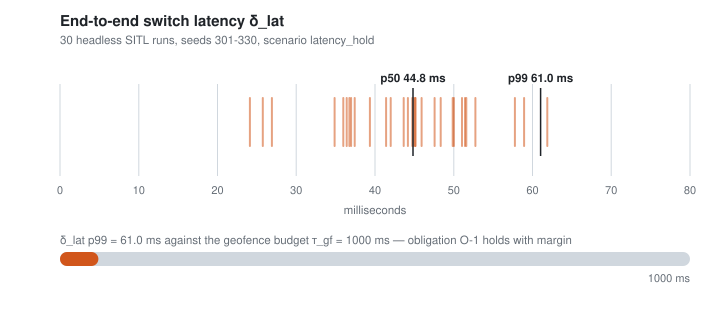
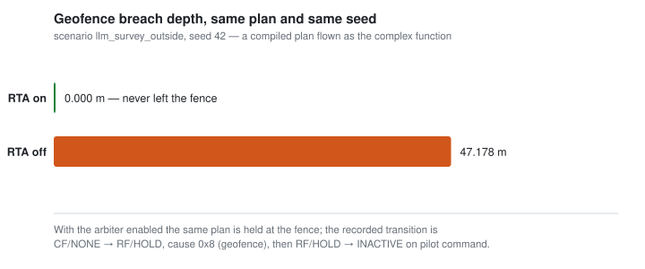

<p align="center">
  
</p>

# Guará

**An open, measured safety boundary for autonomous and LLM-embodied flight — in the air and in orbit.**

Runtime Assurance (RTA) aligned with the ASTM F3269 architecture. An untrusted complex
function — a classical planner, a neural policy, or a language model — commands the vehicle
through a gateway that clamps what it may ask for. Monitors generated from formal requirements,
a geofence predictor and a DAA node watch the physical state. When any of them says the next
seconds are unsafe, an arbiter takes authority away from the complex function and hands the
vehicle to the platform's own assured recovery mode inside a **measured** end-to-end latency.

One switching core, two hosts:

| | Air — **implemented and measured** | Space — **specified** |
|---|---|---|
| Platform | PX4 v1.17 + ROS 2 Humble, arbiter as a `ModeExecutor` | F´ v4.3.0, arbiter as an FPP component on a rate group |
| Recovery function | PX4 internal modes Hold / RTL / Land — assured and pre-existing | Safe mode — **F´ has none; the project must write it** |
| Evidence today | 30-run headless SITL batch, p99 switch latency **61 ms** | Analytic keep-out predictor and a closed intent vocabulary |
| Documents | [ADR 0001](docs/adr/0001-arbiter-as-mode-executor.md), [`docs/SPEC.md`](docs/SPEC.md) | [ADR 0011](docs/adr/0011-fprime-as-second-rta-host.md), [ADR 0012](docs/adr/0012-space-domain-rta-mapping.md) |

[](https://github.com/aton-of-data/guara-llm-embodied-flight/actions/workflows/checks.yml)
[](LICENSE)
[](third_party/VERSIONS.md)
[](third_party/VERSIONS.md)
[-lightgrey.svg)](docs/adr/0011-fprime-as-second-rta-host.md)
[](docs/milestones/STATUS.md)

**Project site** — the same material, organised for reading rather than for grepping:
[**aton-of-data.github.io/guara-llm-embodied-flight**](https://aton-of-data.github.io/guara-llm-embodied-flight/)
(overview, architecture, an integration guide, and the evidence). Source in [`site/`](site).

**Built on** — upstream projects, at the commits pinned in
[`third_party/VERSIONS.md`](third_party/VERSIONS.md). Wordmarks are used nominatively to say
what Guará integrates; see [§12 · Trademarks](docs/LICENSING.md#trademarks).

[](https://github.com/NASA-SW-VnV/fret)
[](https://github.com/nasa/ogma)
[](https://github.com/Copilot-Language/copilot)
[](https://github.com/nasa/daidalus)
[](https://github.com/Auterion/px4-ros2-interface-lib)

> This is not certification, and it is not a product. It is a research prototype whose claims
> are limited to what an executed command in `results/` supports. Read
> [§7 · Limits](#7--limits-what-guará-does-not-guarantee) before citing anything here.

---

## Table of contents

| § | Section | For |
|---|---|---|
| [1](#1--the-gap) | The gap | Reviewers, funders |
| [2](#2--related-work-and-the-open-threads-guará-answers) | Related work and the open threads Guará answers | Researchers |
| [3](#3--principles) | Principles | Everyone |
| [4](#4--scope-two-domains-one-core) | Scope: two domains, one core | Everyone |
| [5](#5--architecture-and-switching-logic) | Architecture and switching logic | Engineers |
| [6](#6--measured-results) | Measured results | Reviewers |
| [7](#7--limits-what-guará-does-not-guarantee) | Limits | Everyone |
| [8](#8--llm-embodiment-the-long-term-goal) | LLM embodiment: the long-term goal | Everyone |
| [9](#9--reproduce-it) | Reproduce it | Users |
| [10](#10--repository-index) | Repository index | Contributors |
| [11](#11--roadmap) | Roadmap | Everyone |
| [12](#12--licensing-copyright-and-the-nosa-boundary) | Licensing, copyright and the NOSA boundary | Integrators, lawyers |
| [13](#13--contributing-citing-contact) | Contributing, citing, contact | Everyone |

---

## 1 · The gap

Four NASA-maintained tools already solve pieces of assured autonomy — **FRET** (requirements),
**Ogma** (monitor generation), **Copilot** (verified monitor C99), **DAIDALUS** (DO-365 detect
and avoid). None of them reaches the dominant open autopilot, and nothing between them closes
the loop from *a property is about to be violated* to *the aircraft changes mode*.

| # | Observation | Verification status |
|---|---|---|
| G1 | NASA's integrated safe-drone stack (ICAROUS) stopped at release V-2.2.6, January 2022, on cFS with an external autopilot. | VERIFIED-SRC |
| G2 | Ogma generates monitors for cFS, ROS 2, F´ and standalone — **no PX4 target**, although PX4's uXRCE-DDS bridge already exposes uORB as ROS 2 messages. | VERIFIED-SRC |
| G3 | PX4's external-mode fallback fires only when the mode *dies* (arming-check timeout). Nothing switches mode because a *safety property* is about to break. | VERIFIED-SRC |
| G4 | The monitoring literature (Volocopter/DLR, CAV 2024; Platum, NFM 2026) explicitly leaves "trigger the contingency automatically" as future work. | VERIFIED-WEB |
| G5 | ASTM F3269 exists precisely to bound unassured functions, AI and ML included; PX4 + LLM projects rely on prompt engineering instead. | VERIFIED-WEB (sample) |
| G6 | Brazil: 13,224 registered agricultural drones (2026-08), ~84% on a single closed platform, under RBAC 100 since 2026-06-16. No open, auditable assurance stack targets that framework. | SECONDARY |

Full claim-by-claim evidence table, including what is still unverified:
[`docs/PROPOSAL.md` §11](docs/PROPOSAL.md). Every API fact used by the code is re-derived from
pinned source in [`GROUNDING.md`](GROUNDING.md) — nothing in this repository is written from
memory of an API.

---

## 2 · Related work and the open threads Guará answers

Guará is deliberately *downstream* of existing projects. The full treatment — the upstream
tools it extends, the natural-language drone-control literature, and the same chain in orbit —
is [**`docs/RELATED-WORK.md`**](docs/RELATED-WORK.md).

The short version. Prior art for talking to a drone is real and growing: ChatGPT for Robotics,
TypeFly, EchoPilot, MAVLinkMCP, AerialClaw and others. What is missing is uniform — the shared
pattern is **safety = prompt engineering + tool restriction + human override**. None of the
surveyed work places a formally specified, latency-measured runtime-assurance boundary between
the model and the autopilot. That boundary is what this repository is.

The adversarial side of the same literature is why the boundary must be independent of the
model: [RoboPAIR](https://arxiv.org/abs/2410.13691) reports a 100% jailbreak rate against three
LLM-controlled robots. Guardrail-style answers constrain the *planner*; Guará constrains the
*aircraft*, which is the only layer a jailbreak cannot talk its way past.

In orbit the same chain applies with different signals: F´ detects but does not recover, its
trusted sequence disposer already exists, and Ogma's F´ monitors cannot trigger anything. So
the space thread is a *rewrite* of the signals, not a port
([`docs/RELATED-WORK.md` §2.3](docs/RELATED-WORK.md#23-the-same-chain-in-orbit)).

---

## 3 · Principles

1. **The complex function proposes, the arbiter disposes, PX4 falls back, the human commands.**
   Authority is ordered, and the order never inverts.
2. **Untrusted means bounded, not merely unprivileged.** The gateway states what it accepts from
   the complex function — freshness on the receiver's clock, envelope clamps, and a shadow check
   of the *proposed* velocity against the geofence predictor before forwarding
   ([ADR 0010](docs/adr/0010-untrusted-complex-function-contract.md)).
3. **No number without a run.** Performance figures come only from `results/` via
   `scripts/aggregate.py`, and the reviewable part of each run is published verbatim under
   [`docs/evidence/`](docs/evidence). A milestone is complete only with an executed command and
   its output.
4. **No API from memory.** Every behavioural claim cites `repo@commit:file:line` in
   [`GROUNDING.md`](GROUNDING.md), against shallow clones pinned in
   [`third_party/VERSIONS.md`](third_party/VERSIONS.md).
5. **Fail closed, degrade loudly.** Enabled channels that go silent are treated as violations;
   an undeclared omission makes the flight profile refuse to start.
6. **Asymmetry.** Hysteresis and dwell time delay the *return* to the complex function only;
   nothing intentionally delays the switch away from it ([obligation O-3](docs/SPEC.md)).
7. **The human keeps the aircraft.** Any RC or GCS mode change, and any PX4 failsafe, drops
   Guará to `INACTIVE` immediately; Guará never defers a PX4 failsafe.
8. **Civil scope only.** No weapons, no target selection, no tracking of specific people for
   enforcement, no covert surveillance, no defeating geofences, remote ID or failsafes
   ([ADR 0009](docs/adr/0009-use-case-capability-packs.md) §4).

---

## 4 · Scope: two domains, one core

What the project covers, what it does not, and how mature each part is. The operation-by-operation
version of this table — one document per flight operation, with its checks, its channels, its
recovery function and its evidence — is the catalogue in
[**`docs/operations/`**](docs/operations/README.md).

### 4.1 Threads

| Thread | Scope | Milestones | Maturity |
|---|---|---|---|
| **Core** | The PX4 RTA: arbiter, geofence predictor, DAIDALUS node, latency budget | M1–M7, P4 | Executed; every AC PASS with a recorded run (§6) |
| **A — air / LLM embodiment** | Voice- and text-driven civil drone operation bounded by that RTA | M8–M12 | M8 complete; M9 in progress, plan flown as the CF in SITL |
| **B — F´ host** | The same decision core inside a flight software framework with heritage | M13–M15 | Specified (ADR 0011); no code |
| **C — space domain** | Orbital constraint monitors, a latched safe mode, orbital dynamics | M13c, M16 | Keep-out predictor and intent schema implemented (AC-47); no host, no simulator |

**Rule O** protects the core: no F´ or space work starts before the PX4 latency and batch results
are complete, because those are what the preprint depends on
([`docs/PLAN-M8-M16.md`](docs/PLAN-M8-M16.md) §1). Rule O is satisfied; that is why thread C
exists at all today, and why it is one geometric predictor rather than a port in progress.

### 4.2 Operations

| Domain | Operations | State |
|---|---|---|
| Air, class **S** (sense) | [survey](docs/operations/air/survey.md), [inspect a point](docs/operations/air/inspect-point.md) | Survey flown as the CF in SITL; inspection compiled and tested |
| Air, safety | [abort](docs/operations/air/abort.md), [land now](docs/operations/air/land-now.md), [return home](docs/operations/air/return-home.md), [status](docs/operations/air/status.md) | Stop grammar implemented and measured model-independent (AC-29); mode mapping and voice are M10 |
| Air, classes **D / T / C** | dispense, transport, cooperate | **Gated**: refuse to load until their monitors exist ([ADR 0009](docs/adr/0009-use-case-capability-packs.md)) |
| Space | [slew](docs/operations/space/slew.md), [point hold](docs/operations/space/point-hold.md), [safe mode](docs/operations/space/safe-mode.md), [abort](docs/operations/space/abort.md), [status](docs/operations/space/status.md) | Schema closed and predictor tested; the host, the dynamics and the safe mode are specified only |

### 4.3 Out of scope, permanently

Weapons and any payload intended to harm; target selection; tracking or identification of
specific people for enforcement or harassment; covert surveillance; interference with other
aircraft; defeating geofences, remote ID or failsafes
([ADR 0009](docs/adr/0009-use-case-capability-packs.md) §4). And, in the space thread, any form
of detect-and-avoid or conjunction assessment: that is a ground-based probabilistic process, and
a DAIDALUS port would be overreach ([ADR 0012](docs/adr/0012-space-domain-rta-mapping.md)
decision 1).

---

## 5 · Architecture and switching logic

The ASTM F3269 role mapping, the runtime view, what the gateway enforces against an untrusted
planner, and the switching core itself are in
[**`docs/ARCHITECTURE.md`**](docs/ARCHITECTURE.md). The engineering truth in full — failure
modes, latency budget, acceptance criteria and open risks — is
[`docs/SPEC.md`](docs/SPEC.md).

In one paragraph: an untrusted complex function publishes `guara_msgs/CfSetpoint` and reaches
PX4 only through an owned mode that clamps it. Copilot monitors, a geofence predictor and a
DAIDALUS node each publish a timestamped verdict. A pure, allocation-free `DecisionCore` at a
fixed period decides whether the next seconds are unsafe, and an actuator calls `scheduleMode`
to hand the vehicle to a PX4 internal mode. Hysteresis and dwell time delay only the *return*
to the complex function; nothing delays the switch away from it.

---

## 6 · Measured results

From a 30-run headless batch on the current build, aggregated by `scripts/aggregate.py`;
contract and metrics published in [`docs/evidence/batch_latency/`](docs/evidence/batch_latency),
narrative in [`docs/milestones/M7.md`](docs/milestones/M7.md).

<p align="center">
  
</p>

| Quantity | p50 | p99 | Note |
|---|---|---|---|
| `δ_lat` — unsafe sample → recovery mode effective | 0.0448 s | **0.0610 s** | sum of stages L0, L2–L6 on validated clocks |
| `τ_rec` — Hold entry until horizontal speed < 0.5 m/s | — | 1.738 s | hover stop, not a traffic-avoidance maneuver |
| PX4 ↔ ROS clock alignment error | — | 4.894 s | far above the 10 ms hypothesis |

Consequences, stated plainly:

- **O-1 holds with margin.** `τ_gf = 1.0 s > 0.061 s`, and `τ_daa = 30 s > 1.738 + 0.061 s`.
- **Cross-process DDS latency is not publishable.** Because the PX4 and ROS clocks differ by
  seconds on this SIH/uXRCE setup, the mixed-clock stage L1 is recorded but excluded from
  `δ_lat`; AC-19 gates any cross-process number until alignment is under 10 ms.
- **`δ_lat` is optimistic by construction.** The `latency_hold` scenario injects the monitor
  verdict, so Copilot processing time (stage L2) is zero on this path.

The same plan, the same seed, with the arbiter enabled and disabled — the paired run behind
AC-31:

<p align="center">
  
</p>

Both figures are generated from the published evidence by
[`scripts/plot_evidence.py`](scripts/plot_evidence.py), which prints every number it draws;
regenerate them with `python3 scripts/plot_evidence.py`.

Acceptance-criteria tracker: [`docs/milestones/STATUS.md`](docs/milestones/STATUS.md). That
table is honest about its own history — an internal review on 2026-09-11 invalidated one false
PASS and eleven rows produced by a checker that had stopped running; the findings, the fixes and
the re-run commands are in [`docs/reviews/`](docs/reviews), and the latency batch above was
discarded and re-measured from scratch on the corrected build.

---

## 7 · Limits: what Guará does not guarantee

The full list is [`docs/SPEC.md` §7](docs/SPEC.md). The ones that most often get overclaimed:

- **It is not certification**, and shows no compliance with F3269, DO-365 or RBAC 100.
- **It does not guarantee collision avoidance.** The v1 DAA recovery is Hold; stopping does not
  move the vehicle away from a converging intruder. Guará guarantees only that the switch
  happens before the predicted loss time, under the measured O-1.
- **It does not survive every one of its own failures.** With an internal recovery mode active,
  the arbiter's death is invisible to PX4 (FM-2); the arbiter cannot re-register in flight
  (FM-3); controller behaviour during the ~1.2 s detection window of FM-1 is [UNKNOWN].
- **It does not protect against spoofed inputs or hostile nodes.** DDS is unauthenticated in
  this phase (FM-12).
- **It cannot detect a wrong requirement.** Monitors check what was specified; a bad FRETish
  formalisation passes silently (FM-10).
- **It runs outside the FMU**, without the autopilot's real-time guarantees. Decision time is
  measured, not proven — there is no WCET analysis.
- **SITL does not transfer.** No result here is a claim about real flight.
- **It does not make a language model correct.** Guará bounds *physical* consequences covered by
  monitors. A mission-level mistake inside the safe envelope — wrong field, wrong dose, wrong
  photograph — is not detected by anything in this repository.

---

## 8 · LLM embodiment: the long-term goal

The direction is an open-source, open-weight, voice-driven agent for civil drones — agriculture
first — whose physical authority is bounded by everything above. The design, the full
limitation inventory (model, voice, compute, perception, regulatory, human factors) and its
mitigation map are in [`docs/research/LLM-EMBODIMENT.md`](docs/research/LLM-EMBODIMENT.md).
Three decisions shape it:

- **The model never emits setpoints, MAVLink or code.** It emits a typed, bounded *Mission
  Intent* over a closed vocabulary. A deterministic, unit-tested mission compiler turns that
  into a plan and rejects anything outside the envelope; the plan, not the model, feeds the CF.
- **The stop path does not pass through the model.** `abort`, `land_now` and `return_home` are
  exact-match grammar plus a physical button, mapped straight to PX4 modes
  ([ADR 0008](docs/adr/0008-language-packs.md)). Languages are drop-in packs — `en` and `pt-BR`
  in tree — gated by an admission check, with the English safety grammar always active.
- **Every use case is a capability pack, gated by risk class**
  ([ADR 0009](docs/adr/0009-use-case-capability-packs.md)): **S** sense (survey, inspection,
  mapping, livestock, forestry), **D** dispense (spraying, spreading, biological release),
  **T** transport, **C** cooperate (SAR support, multi-vehicle). A pack loads only when every
  monitor it requires exists and passes its acceptance criteria, and its regulatory
  preconditions are configured; D, T and C are disabled until the monitors and the airframe
  tier exist.

Four providers ship: `mock` (rule-based, no key and no network, which is what makes the
harness itself testable), `ollama` (a local open-weight model, no key and no account),
`openai-compat` (OpenAI and any server on the same route — vLLM, llama.cpp, LM Studio,
OpenRouter — selected by base URL), and `cursor-agent`. A provider is a text channel: prompt
in, text out. It never sees the site model, never sees a plan and never learns what the
expected answer was, so adding one cannot change a result.

---

## 9 · Reproduce it

### In 60 seconds, with no container

The trusted layer between a model and the aircraft is pure Python. `pip install -e .`
installs it as the `guara` package (G-S3); `guara doctor` is the workstation preflight
(AC-51). The hermetic path (AC-52) is `pip install --require-hashes -r requirements.lock`
then `pip install -e . --no-deps`; the lock is generated on CPython 3.10 by
`scripts/lock_python.sh`. `pip install -r requirements.txt` still works if you do not
want a package install. This runs the deterministic compiler directly — no ROS 2, no
PX4 build, no model, no key:

```bash
pip install -e .
guara doctor

# a Mission Intent inside the envelope -> a flyable plan (exit 0)
guara compile --intent mission/intents/survey_north_3.json

# the same intent asking for 40 cm/px -> a refusal that names the checks (exit 2)
guara compile --intent mission/intents/survey_north_3_out_of_envelope.json
# refused (checks): gsd_bounds, altitude_ceiling, energy

# the stop path, which never reaches a model at all (AC-29), in both shipped languages
guara compile --stop "land now"     # -> land_now
guara compile --stop "pouse agora"  # -> land_now
```

The second command is the point: an intent that is well-formed, schema-valid and completely
reasonable-sounding is refused by named, deterministic checks before anything flies. Turning an
*utterance* into an intent is the untrusted step and needs a provider — that is
`scripts/llm/eval.py`. Add `-r requirements-dev.txt` and `python3 -m pytest scripts/tests -q`
runs the mission compiler, the corpus, the plan executor and the space keep-out tests.

### The kernel on its own, with no ROS and no container

The switching core is also a host-free CMake library with a C ABI, released together with the
published conformance vectors ([ADR 0014](docs/adr/0014-delivery-model.md)). Building it needs a
C++17 compiler and nothing else:

```bash
cmake -S core -B build/core -DCMAKE_BUILD_TYPE=Release
cmake --build build/core
ctest --test-dir build/core --output-on-failure

guara ctk run --port python   # the independent port, over the whole published set
guara ctk run --port sil      # the same vectors through the C ABI
```

Both runs print a report naming the core version, the ABI version, the host, the architecture and
the hash of the vector set, and stating in its own text that conformance is necessary and not
sufficient. [`core/README.md`](core/README.md) is the integrator's page: the storage contract, the
CMake consumption path, and what the kit does and does not demonstrate.

### Everything else

Everything else runs in Docker with the repository mounted at `/work`. `scripts/dev.sh` builds
the image on first use; when a published one exists it can be pulled instead:

```bash
docker pull ghcr.io/aton-of-data/guara-dev:m1 && export GUARA_IMAGE=ghcr.io/aton-of-data/guara-dev:m1
```

The formal-methods image is deliberately **not** published: it embeds FRET, which is under the
NASA Open Source Agreement, and distributing a container that embeds NOSA code needs the legal
review tracked as risk R-9 ([ADR 0003](docs/adr/0003-daidalus-nosa-isolation.md)). Build it
locally with `./scripts/fm.sh`.

Images: `guara-dev:m1`
([`docker/Dockerfile`](docker/Dockerfile), ROS 2 Humble + PX4 v1.17.0 SIH SITL + Micro XRCE-DDS
Agent) and `guara-fm:m2` ([`docker/Dockerfile.fm`](docker/Dockerfile.fm), FRET + Ogma + Copilot,
generation only).

```bash
./scripts/fetch_third_party.sh            # pinned shallow clones (once)
# Cached clones and image: GUARA_OFFLINE=1 ./scripts/dev.sh colcon test --packages-select guara_rta

./scripts/dev.sh colcon build --symlink-install
./scripts/dev.sh colcon test --packages-select guara_rta guara_geofence guara_monitors

./scripts/sitl_run.sh --scenario hover --seed 42 --headless
```

| Task | Command |
|---|---|
| One scenario, headless and seeded | `./scripts/sitl_run.sh --scenario <name> --seed 42 --headless` |
| RTA on vs off, same seed | `./scripts/sitl_pair.sh --scenario gf_straight_concave --seed 42` |
| Latency batch, then aggregate | `./scripts/sitl_batch.sh --runs 30 --seed-start 1` then `./scripts/dev.sh python3 scripts/aggregate.py results/batch_latency` |
| Check one acceptance criterion | `./scripts/dev.sh python3 scripts/check_ac.py AC-18 results/batch_latency` |
| Verify a run's contract | `./scripts/dev.sh python3 scripts/check_run_contract.py results/latest` |
| Publish a run for review | `./scripts/publish_evidence.py results/latest` |
| NOSA-isolated DAA node | `./scripts/daa.sh build` · `./scripts/daa.sh test` |
| Regenerate monitors from FRETish | `./scripts/fm.sh ros2_ws/src/guara_monitors/scripts/generate.sh` |
| Verify the licence boundary | `python3 scripts/check_license_isolation.py` |
| Verify the SPDX headers and the document links | `python3 scripts/check_spdx.py` · `python3 scripts/check_links.py` |
| Mission compiler, corpus and plan executor | `./scripts/dev.sh python3 -m pytest scripts/tests -q` |
| LLM corpus against a local open-weight model | `ollama pull llama3.1:8b` then `python3 scripts/llm/eval.py --provider ollama --model llama3.1:8b` |
| LLM corpus against any OpenAI-compatible server | `GUARA_OPENAI_BASE_URL=http://localhost:8000/v1 python3 scripts/llm/eval.py --provider openai-compat --model <id>` |
| Space keep-out predictor (AC-47) | `./scripts/dev.sh python3 scripts/check_ac.py AC-47` |

The four commands above that take a `results/...` path need a run to exist first; `results/` is
git-ignored and empty in a fresh clone ([`results/README.md`](results/README.md)). Point them at
a published directory under [`docs/evidence/`](docs/evidence) to check a number without running
anything.

Every run writes `results/{run_id}/` with the scenario hash, the seed, the Guará SHA, the PX4
build commit, the pinned third-party commits and the PX4 parameters read back from the vehicle —
which is what makes a number re-derivable rather than merely reported. Fourteen scenarios ship in
[`scenarios/`](scenarios), including the deliberately nasty ones: `kill_arbiter_in_cf`,
`kill_arbiter_in_hold`, `hang_decision_thread`, `hang_ros_executor`, `stale_local_position`,
`pilot_override`, `restart_arbiter_armed`.

---

## 10 · Repository index

| Path | Contents |
|---|---|
| [`docs/operations/`](docs/operations/README.md) | **The scope map: one document per flight operation, air and space, with its checks, channels, recovery function and evidence** |
| [`docs/RELATED-WORK.md`](docs/RELATED-WORK.md) · [`docs/ARCHITECTURE.md`](docs/ARCHITECTURE.md) · [`docs/ROADMAP.md`](docs/ROADMAP.md) · [`docs/LICENSING.md`](docs/LICENSING.md) | The long sections split out of this README: prior art, the runtime view and switching core, the milestone plan, and the licence and trademark position |
| [`docs/SPEC.md`](docs/SPEC.md) | The engineering truth: scope, F3269 mapping, switching logic, latency budget, failure modes, acceptance criteria, limits, open risks |
| [`docs/PROPOSAL.md`](docs/PROPOSAL.md) | Founding document: gap, contributions C1–C4, research questions RQ1–RQ6, schedule, claim verification |
| [`GROUNDING.md`](GROUNDING.md) | Every API fact, cited as `repo@commit:file:line`, with a confidence level |
| [`core/`](core/README.md) | **`guara-core`: the host-free switching kernel with a C ABI, the CMake package, the published conformance vectors and their runners** |
| [`docs/adr/`](docs/adr) | Fourteen decisions, including the untrusted-CF contract, F´ as second host, space-domain signals, and the LLM evaluation protocol |
| [`docs/milestones/`](docs/milestones) | M1–M5, M7–M9 and M13c reports with executed commands, plus the [AC tracker](docs/milestones/STATUS.md) covering AC-1…AC-66 |
| [`docs/reviews/`](docs/reviews) | Internal reviews with their remediation records: M1–M5, public readiness, and the M17–M19 kernel and conformance kit |
| [`docs/research/LLM-EMBODIMENT.md`](docs/research/LLM-EMBODIMENT.md) | Limitations and design for the voice/LLM layer, with the civil use-case catalogue |
| [`docs/research/SPACE-AUTONOMY.md`](docs/research/SPACE-AUTONOMY.md) | F´, Ogma's F´ backend, and where a Guará-class RTA fits in orbit |
| [`docs/PLAN-M8-M16.md`](docs/PLAN-M8-M16.md) · [`docs/PLAN-M17-M28.md`](docs/PLAN-M17-M28.md) | Executable plans: LLM embodiment, the F´ port and the space domain; then delivery, the gap register and the path to real hardware |
| [`docs/evidence/`](docs/evidence) | Run contracts and metrics published verbatim from `results/` |
| `mission/` | Mission Intent schema, site model, deterministic compiler, labelled corpus, trusted plan executor |
| `space/` | Space intent schema, attitude keep-out predictor, demo-sat vehicle model |
| `ros2_ws/src/guara_rta` | `DecisionCore`, input manager, gateway logic, actuator, safety profile, ModeExecutor node, 12 test suites |
| `ros2_ws/src/guara_geofence` | Predictor with braking distance and position-uncertainty handling |
| `ros2_ws/src/guara_monitors` | FRETish specs, `px4_msgs` variable DB, Ogma template, generated Copilot C99, monitor node |
| `ros2_ws/src/guara_msgs` | `CfSetpoint`, `MonitorVerdict`, `DaaStatus`, `RtaState`, `RtaEvent` |
| `nosa/guara_daidalus` | DAIDALUS ROS 2 node, kept off the default colcon path |
| [`config/`](config) | RTA parameters, copied into every run's `config.yaml` |
| [`scripts/`](scripts) | Container wrappers, run contract, AC checkers, aggregation, evidence publishing |
| [`third_party/VERSIONS.md`](third_party/VERSIONS.md) | Pinned commits and the PX4 ↔ `px4_msgs` byte-equality check |
| [`NOTICE`](NOTICE) · [`CITATION.cff`](CITATION.cff) | Copyright, third-party licences, and how to cite the repository |
| [`CONTRIBUTING.md`](CONTRIBUTING.md) · [`SECURITY.md`](SECURITY.md) · [`CODE_OF_CONDUCT.md`](CODE_OF_CONDUCT.md) | How to contribute, how to report a vulnerability, and the conduct standard |
| [`CLAUDE.md`](CLAUDE.md) · [`docs/guara-prompt-pack.md`](docs/guara-prompt-pack.md) · [`docs/AGENT-PIPELINE.md`](docs/AGENT-PIPELINE.md) | The working rules, the reproducible prompt sequence used to build this, and the scope / execute / review process the agents run under |

---

## 11 · Roadmap

Six threads, with the state of each taken from
[`docs/milestones/STATUS.md`](docs/milestones/STATUS.md) rather than restated here:

| Thread | What it is | Milestones | State |
|---|---|---|---|
| core | The PX4 RTA: arbiter, geofence, DAA, latency and batch | M1–M7, P4 | done and measured; P5–P7 not started |
| A | Air and LLM embodiment | M8–M12, M9b | M8 done; M9 in progress; M9b onward planned |
| B | The F´ host | M13–M15 | specified; no deployment has run |
| C | The space domain | M13c, M16 | AC-47 PASS; AC-48 needs a simulator |
| S | Setup and reproducibility | M17 | in progress — `guara doctor`, the hash-pinned lock, offline mode |
| K | The kernel and its delivery | M18–M20 | in progress — the host-free kernel, its C ABI and the conformance kit; nothing published yet |

No criterion of M17, M18 or M19 is PASS: code exists, and a criterion becomes PASS only with an
executed command and an excerpt in a milestone report. The milestone-by-milestone version with the
gate on each is [**`docs/ROADMAP.md`**](docs/ROADMAP.md); ten criteria added on 2026-09-13 —
the space gate of [ADR 0015](docs/adr/0015-space-untrusted-function-contract.md), its published
vectors, safe-mode entry logic and its keep-out sweep, a space adversarial corpus, model-side
runtime discipline, corpus coverage, monitor non-vacuity, and the core semantics the SPEC does not
state — are specified in [`docs/PLAN-M17-M28.md`](docs/PLAN-M17-M28.md) §9.

Blocking risks. The four families — `R-*`, `RP-*`, `RS-*`, `RH-*` — are indexed in
[`docs/SPEC.md` §9](docs/SPEC.md), which names the document defining each: CopilotVerifier
toolchain availability (R-11, blocks RQ4), DO-365B thresholds unsuited to small UAS (R-5), Hold
as a DAA recovery against converging traffic (R-6), traffic injection in SITL never exercised
(R-7), the unavailable ASTM F3269 text (R-8), and the space thread's own RS-1…RS-6 — of which
RS-1, the safe mode with no heritage, is the one a reviewer should attack first.

---

## 12 · Licensing, copyright and the NOSA boundary

Guará is **Apache-2.0** ([`LICENSE`](LICENSE), [`NOTICE`](NOTICE),
[ADR 0006](docs/adr/0006-license-apache-2.md)) — the same licence as Ogma, cFS, F´ and ROS 2.
Every source file carries `SPDX-License-Identifier: Apache-2.0`, checked by
`scripts/check_spdx.py`.

> Copyright 2026 Aton Bertini Dornfeld &lt;dornfeld.in@gmail.com&gt; and the Guará contributors.

DAIDALUS and FRET are under the NASA Open Source Agreement; NOSA code lives only in
[`nosa/`](nosa) and the boundary is enforced by `scripts/check_license_isolation.py`, not by
convention. The full position — the NOSA boundary, the `[REVIEW]` legal question, and the
trademark statement covering NASA, PX4, Dronecode and ROS marks — is
[**`docs/LICENSING.md`**](docs/LICENSING.md).

---

## 13 · Contributing, citing, contact

**Contributing.** [`CONTRIBUTING.md`](CONTRIBUTING.md) is the guide;
[`CODE_OF_CONDUCT.md`](CODE_OF_CONDUCT.md) applies. In short: every safety function needs a test
that fails before the implementation. Commits are granular — one logical change each — and
messages follow `type(scope): imperative summary`. C++17 with colcon/ament, gtest and
launch_testing; the decision path carries no dynamic allocation and bounded time. If a change
touches an API, add the `repo@commit:file:line` row to `GROUNDING.md` first. No performance claim
enters a document without a run in `results/` and the command that produced it. A new flight
operation needs its own document in [`docs/operations/`](docs/operations/README.md) before it
needs code.

**Security.** Do not open a public issue for a vulnerability — [`SECURITY.md`](SECURITY.md) has
the private disclosure address, the accepted limitations of this phase (FM-12 above all), and
what does count as a physical-authority escape.

**The most useful contributions right now** are a Haskell/LLVM/z3 environment that unblocks
CopilotVerifier (R-11), sourced well-clear thresholds for small UAS (R-5), a traffic-injection
path in PX4 SITL (R-7), an SROS2 profile for the CF topics (FM-12), a review of §5.1 against the
licensed ASTM F3269 text (R-8), and — for the space thread — a Basilisk ↔ ROS 2 setup that lets
the existing arbiter face orbital dynamics (AC-48) and a review of the safe-mode specification
by someone who has flown one (RS-1).

**Citing.** There is no preprint yet; cite the repository and the commit
([`CITATION.cff`](CITATION.cff)). Every quantitative claim should cite the run directory under
[`docs/evidence/`](docs/evidence) that produced it, not this README.

**Contact.** Aton Bertini Dornfeld — <dornfeld.in@gmail.com>.

**Scope.** Civil flight safety, in the air and in orbit. Contributions implementing weapons,
target selection, or surveillance of specific people will not be accepted.
