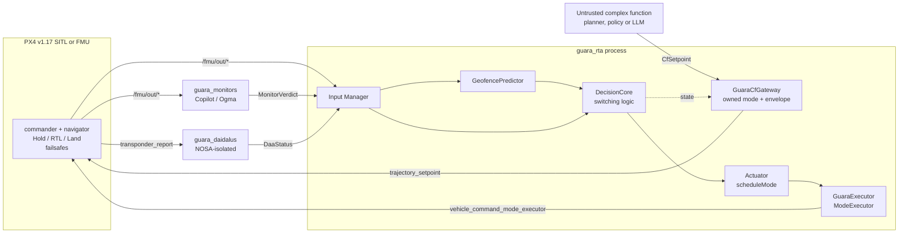

<p align="center">
  
</p>

# Guará

**An open, measured safety boundary for autonomous and LLM-embodied flight — in the air and in orbit.**

Runtime Assurance (RTA) aligned with the ASTM F3269 architecture. An untrusted complex
function — a classical planner, a neural policy, or a language model — commands the vehicle
through a gateway that clamps what it may ask for. Monitors generated from formal requirements,
a geofence predictor and a DAA node watch the physical state. When any of them says the next
seconds are unsafe, an arbiter takes authority away from the complex function and hands the
vehicle to the platform's own assured recovery mode inside a **measured** end-to-end latency.

One switching core, two hosts:

| | Air — **implemented and measured** | Space — **specified** |
|---|---|---|
| Platform | PX4 v1.17 + ROS 2 Humble, arbiter as a `ModeExecutor` | F´ v4.3.0, arbiter as an FPP component on a rate group |
| Recovery function | PX4 internal modes Hold / RTL / Land — assured and pre-existing | Safe mode — **F´ has none; the project must write it** |
| Evidence today | 30-run headless SITL batch, p99 switch latency **61 ms** | Analytic keep-out predictor and a closed intent vocabulary |
| Documents | [ADR 0001](docs/adr/0001-arbiter-as-mode-executor.md), [`docs/SPEC.md`](docs/SPEC.md) | [ADR 0011](docs/adr/0011-fprime-as-second-rta-host.md), [ADR 0012](docs/adr/0012-space-domain-rta-mapping.md) |

[](LICENSE)
[](third_party/VERSIONS.md)
[](third_party/VERSIONS.md)
[-lightgrey.svg)](docs/adr/0011-fprime-as-second-rta-host.md)
[](docs/milestones/STATUS.md)

**Built on** — upstream projects, at the commits pinned in
[`third_party/VERSIONS.md`](third_party/VERSIONS.md). Wordmarks are used nominatively to say
what Guará integrates; see [§13 · Trademarks](#trademarks).

[](https://github.com/NASA-SW-VnV/fret)
[](https://github.com/nasa/ogma)
[](https://github.com/Copilot-Language/copilot)
[](https://github.com/nasa/daidalus)
[](https://github.com/Auterion/px4-ros2-interface-lib)

> This is not certification, and it is not a product. It is a research prototype whose claims
> are limited to what an executed command in `results/` supports. Read
> [§8 · Limits](#8--limits-what-guará-does-not-guarantee) before citing anything here.

---

## Table of contents

| § | Section | For |
|---|---|---|
| [1](#1--the-gap) | The gap | Reviewers, funders |
| [2](#2--related-work-and-the-open-threads-guará-answers) | Related work and the open threads Guará answers | Researchers |
| [3](#3--principles) | Principles | Everyone |
| [4](#4--scope-two-domains-one-core) | Scope: two domains, one core | Everyone |
| [5](#5--architecture) | Architecture | Engineers |
| [6](#6--switching-logic) | Switching logic | Engineers, reviewers |
| [7](#7--measured-results) | Measured results | Reviewers |
| [8](#8--limits-what-guará-does-not-guarantee) | Limits | Everyone |
| [9](#9--llm-embodiment-the-long-term-goal) | LLM embodiment: the long-term goal | Everyone |
| [10](#10--reproduce-it) | Reproduce it | Users |
| [11](#11--repository-index) | Repository index | Contributors |
| [12](#12--roadmap) | Roadmap | Everyone |
| [13](#13--licensing-copyright-and-the-nosa-boundary) | Licensing, copyright and the NOSA boundary | Integrators, lawyers |
| [14](#14--contributing-citing-contact) | Contributing, citing, contact | Everyone |

---

## 1 · The gap

Four NASA-maintained tools already solve pieces of assured autonomy — **FRET** (requirements),
**Ogma** (monitor generation), **Copilot** (verified monitor C99), **DAIDALUS** (DO-365 detect
and avoid). None of them reaches the dominant open autopilot, and nothing between them closes
the loop from *a property is about to be violated* to *the aircraft changes mode*.

| # | Observation | Verification status |
|---|---|---|
| G1 | NASA's integrated safe-drone stack (ICAROUS) stopped at release V-2.2.6, January 2022, on cFS with an external autopilot. | VERIFIED-SRC |
| G2 | Ogma generates monitors for cFS, ROS 2, F´ and standalone — **no PX4 target**, although PX4's uXRCE-DDS bridge already exposes uORB as ROS 2 messages. | VERIFIED-SRC |
| G3 | PX4's external-mode fallback fires only when the mode *dies* (arming-check timeout). Nothing switches mode because a *safety property* is about to break. | VERIFIED-SRC |
| G4 | The monitoring literature (Volocopter/DLR, CAV 2024; Platum, NFM 2026) explicitly leaves "trigger the contingency automatically" as future work. | VERIFIED-WEB |
| G5 | ASTM F3269 exists precisely to bound unassured functions, AI and ML included; PX4 + LLM projects rely on prompt engineering instead. | VERIFIED-WEB (sample) |
| G6 | Brazil: 13,224 registered agricultural drones (2026-08), ~84% on a single closed platform, under RBAC 100 since 2026-06-16. No open, auditable assurance stack targets that framework. | SECONDARY |

Full claim-by-claim evidence table, including what is still unverified:
[`docs/PROPOSAL.md` §11](docs/PROPOSAL.md). Every API fact used by the code is re-derived from
pinned source in [`GROUNDING.md`](GROUNDING.md) — nothing in this repository is written from
memory of an API.

---

## 2 · Related work and the open threads Guará answers

Guará is deliberately *downstream* of existing projects. Each row is a thread left open in
another repository or paper, and what Guará contributes to it.

### 2.1 Upstream tools Guará extends

| Repository | What it gives | Open thread | Guará's answer |
|---|---|---|---|
| [nasa/ogma](https://github.com/nasa/ogma) `v1.15.0` | FRETish → Copilot → C99 monitor generation, ROS 2 backend | No PX4 variable database or example | `guara_monitors` carries a `px4_msgs` variable DB, a customised ROS template and a generated monitor over `/fmu/out/*`; upstreaming is contribution **C2** |
| [Copilot-Language/copilot](https://github.com/Copilot-Language/copilot) `v4.8.1` | Constant-time, allocation-free monitor C99; CopilotVerifier proofs | Verifier toolchain unavailable on this host (risk R-11) | Monitors are generated and unit-tested today; proof generation is the RQ4 deliverable |
| [NASA-SW-VnV/fret](https://github.com/NASA-SW-VnV/fret) `v3.1.0` | FRETish → pmLTL, export to Ogma | Export path never exercised for PX4 properties | `REQ-ALT-01` runs the flow end to end into a flying monitor (M2) |
| [nasa/daidalus](https://github.com/nasa/daidalus) `v2.0.3a` | DO-365 well-clear, time to violation, maneuver bands | NOSA licence blocks mixing with permissive stacks; DO-365B thresholds are sized for large aircraft | `nosa/guara_daidalus` is a licence-isolated ROS 2 node ([ADR 0003](docs/adr/0003-daidalus-nosa-isolation.md)); small-UAS thresholds remain open risk R-5 |
| [nasa/icarous](https://github.com/nasa/icarous) | The architectural precedent: DAIDALUS + PolyCARP as cFS apps | Dormant since 2022, cFS-bound, external autopilot | Same roles, rebuilt on PX4 + ROS 2 with the autopilot itself as the recovery function |
| [PX4/PX4-Autopilot](https://github.com/PX4/PX4-Autopilot) `v1.17.0` | Internal modes as a recovery function; external-mode interface | [PR #20707](https://github.com/PX4/PX4-Autopilot/pull/20707) suggests extending fallback beyond arming-check timeouts | Guará is a semantic fallback layered on the existing interface, leaving PX4 failsafes untouched and authoritative |
| [Auterion/px4-ros2-interface-lib](https://github.com/Auterion/px4-ros2-interface-lib) `release/1.17` | `ModeExecutorBase`, owned modes, `scheduleMode` | Executor-death timing in flight documented only partially | Failure modes FM-1…FM-5 are measured in SITL and recorded in [`docs/SPEC.md` §5](docs/SPEC.md) |

### 2.2 Natural-language drone control: what everyone leaves to the prompt

Prior art for talking to a drone is real and growing. What is missing is uniform.

| Work | Approach | Stated safety basis |
|---|---|---|
| ChatGPT for Robotics / PromptCraft ([arXiv 2306.17582](https://ar5iv.labs.arxiv.org/html/2306.17582)) | LLM writes code over an AirSim function library | Human reviews the code |
| TypeFly ([arXiv 2312.14950](https://arxiv.org/abs/2312.14950)) | LLM emits MiniSpec, a token-efficient DSL | The DSL restricts the action set |
| Taking Flight with Dialogue ([arXiv 2506.07509](https://arxiv.org/abs/2506.07509)) | PX4 + ROS 2 + local Ollama, sim and real quadcopter | Not specified |
| EchoPilot ([PX4 forum](https://discuss.px4.io/t/echopilot-langgraph-mcp-server-for-natural-language-px4-control/46998)) | Voice → LangGraph → MCP → MAVSDK → PX4 | Telemetry verification; author asks the community for safety ideas |
| [MAVLinkMCP](https://github.com/ion-g-ion/MAVLinkMCP), [ardupilot-mcp](https://github.com/rmeadomavic/ardupilot-mcp) | MCP servers exposing MAVLink to agents | SITL-first, human in the loop |
| Universal LLM–Drone C2 ([arXiv 2601.15486](https://arxiv.org/html/2601.15486v2)) | MCP + MAVSDK, many models, caged sub-250 g drone | Human override; non-determinism acknowledged |
| AerialClaw ([arXiv 2606.12142](https://arxiv.org/abs/2606.12142)) | Brain–skill–runtime agent framework on PX4 SITL | "Safety-oriented runtime validation", unspecified |

The shared pattern is **safety = prompt engineering + tool restriction + human override**.
None of the surveyed work places a formally specified, latency-measured runtime-assurance
boundary between the model and the autopilot. That boundary is what this repository is.

The adversarial side of the same literature is why the boundary must be independent of the
model: [RoboPAIR](https://arxiv.org/abs/2410.13691) reports a 100% jailbreak rate against three
LLM-controlled robots, and [DolphinAttack](https://arxiv.org/pdf/1708.09537) shows voice itself
is an attack surface. Guardrail-style answers ([RoboGuard](https://arxiv.org/abs/2503.07885),
[SafePlan](https://arxiv.org/abs/2503.06892), [Safety Chip](https://arxiv.org/pdf/2309.09919))
constrain the *planner*; Guará constrains the *aircraft*, which is the only layer a jailbreak
cannot talk its way past.

### 2.3 The same chain, in orbit

The requirements half of the chain — FRET → Ogma → Copilot — already targets cFS and F´, the
flight software of spacecraft and small satellites, as first-class backends. Three facts,
re-derived from the pinned clones and recorded in [`GROUNDING.md`](GROUNDING.md) Addendum D,
decide the shape of the space thread:

- **F´ detects, but does not recover.** `Svc::Health` pings components, tracks timeouts, raises
  FATAL and strokes a watchdog (D.2) — and a grep for `safe.?mode` over `Svc/` and `Fw/` returns
  nothing (D.5). On PX4 the recovery function was free; on F´ it is the most safety-critical
  code the project would have to write.
- **The trusted disposer already exists.** `Svc::FpySequencer` validates a compiled sequence
  before running it (D.3) — exactly the artifact [ADR 0010](docs/adr/0010-untrusted-complex-function-contract.md)
  rule 6 demands between a model and an actuator. It is pre-release upstream (D.4), so nothing
  here depends on it irreversibly.
- **Ogma's F´ monitors cannot trigger anything.** The generated component emits events only,
  into a hardcoded `module Ref`, with no verdict output port (D.8). That is the same gap G3
  identifies for PX4, restated in the space domain — and two small upstream contributions.

So the space thread is a *rewrite* of the signals, not a port: `T_gf`'s braking model assumes a
vehicle that can stop, and `T_daa` is an air-traffic construct
([ADR 0012](docs/adr/0012-space-domain-rta-mapping.md),
[`docs/research/SPACE-AUTONOMY.md`](docs/research/SPACE-AUTONOMY.md)). What transfers is the
architecture: predicted time to violation, threshold with hysteresis, asymmetric switch, gate on
the untrusted function. Analytic keep-out tests live in `space/keepout.py` and pass AC-47
([`docs/milestones/M13c.md`](docs/milestones/M13c.md)). **No F´ deployment has run.** Everything
*measured* in this repository is PX4 multicopter in SITL.

---

## 3 · Principles

1. **The complex function proposes, the arbiter disposes, PX4 falls back, the human commands.**
   Authority is ordered, and the order never inverts.
2. **Untrusted means bounded, not merely unprivileged.** The gateway states what it accepts from
   the complex function — freshness on the receiver's clock, envelope clamps, and a shadow check
   of the *proposed* velocity against the geofence predictor before forwarding
   ([ADR 0010](docs/adr/0010-untrusted-complex-function-contract.md)).
3. **No number without a run.** Performance figures come only from `results/` via
   `scripts/aggregate.py`, and the reviewable part of each run is published verbatim under
   [`docs/evidence/`](docs/evidence). A milestone is complete only with an executed command and
   its output.
4. **No API from memory.** Every behavioural claim cites `repo@commit:file:line` in
   [`GROUNDING.md`](GROUNDING.md), against shallow clones pinned in
   [`third_party/VERSIONS.md`](third_party/VERSIONS.md).
5. **Fail closed, degrade loudly.** Enabled channels that go silent are treated as violations;
   an undeclared omission makes the flight profile refuse to start.
6. **Asymmetry.** Hysteresis and dwell time delay the *return* to the complex function only;
   nothing intentionally delays the switch away from it ([obligation O-3](docs/SPEC.md)).
7. **The human keeps the aircraft.** Any RC or GCS mode change, and any PX4 failsafe, drops
   Guará to `INACTIVE` immediately; Guará never defers a PX4 failsafe.
8. **Civil scope only.** No weapons, no target selection, no tracking of specific people for
   enforcement, no covert surveillance, no defeating geofences, remote ID or failsafes
   ([ADR 0009](docs/adr/0009-use-case-capability-packs.md) §4).

---

## 4 · Scope: two domains, one core

What the project covers, what it does not, and how mature each part is. The operation-by-operation
version of this table — one document per flight operation, with its checks, its channels, its
recovery function and its evidence — is the catalogue in
[**`docs/operations/`**](docs/operations/README.md).

### 4.1 Threads

| Thread | Scope | Milestones | Maturity |
|---|---|---|---|
| **Core** | The PX4 RTA: arbiter, geofence predictor, DAIDALUS node, latency budget | M1–M7, P4 | Executed; every AC PASS with a recorded run (§7) |
| **A — air / LLM embodiment** | Voice- and text-driven civil drone operation bounded by that RTA | M8–M12 | M8 complete; M9 in progress, plan flown as the CF in SITL |
| **B — F´ host** | The same decision core inside a flight software framework with heritage | M13–M15 | Specified (ADR 0011); no code |
| **C — space domain** | Orbital constraint monitors, a latched safe mode, orbital dynamics | M13c, M16 | Keep-out predictor and intent schema implemented (AC-47); no host, no simulator |

**Rule O** protects the core: no F´ or space work starts before the PX4 latency and batch results
are complete, because those are what the preprint depends on
([`docs/PLAN-M8-M16.md`](docs/PLAN-M8-M16.md) §1). Rule O is satisfied; that is why thread C
exists at all today, and why it is one geometric predictor rather than a port in progress.

### 4.2 Operations

| Domain | Operations | State |
|---|---|---|
| Air, class **S** (sense) | [survey](docs/operations/air/survey.md), [inspect a point](docs/operations/air/inspect-point.md) | Survey flown as the CF in SITL; inspection compiled and tested |
| Air, safety | [abort](docs/operations/air/abort.md), [land now](docs/operations/air/land-now.md), [return home](docs/operations/air/return-home.md), [status](docs/operations/air/status.md) | Stop grammar implemented and measured model-independent (AC-29); mode mapping and voice are M10 |
| Air, classes **D / T / C** | dispense, transport, cooperate | **Gated**: refuse to load until their monitors exist ([ADR 0009](docs/adr/0009-use-case-capability-packs.md)) |
| Space | [slew](docs/operations/space/slew.md), [point hold](docs/operations/space/point-hold.md), [safe mode](docs/operations/space/safe-mode.md), [abort](docs/operations/space/abort.md), [status](docs/operations/space/status.md) | Schema closed and predictor tested; the host, the dynamics and the safe mode are specified only |

### 4.3 Out of scope, permanently

Weapons and any payload intended to harm; target selection; tracking or identification of
specific people for enforcement or harassment; covert surveillance; interference with other
aircraft; defeating geofences, remote ID or failsafes
([ADR 0009](docs/adr/0009-use-case-capability-packs.md) §4). And, in the space thread, any form
of detect-and-avoid or conjunction assessment: that is a ground-based probabilistic process, and
a DAIDALUS port would be overreach ([ADR 0012](docs/adr/0012-space-domain-rta-mapping.md)
decision 1).

---

## 5 · Architecture

### 5.1 ASTM F3269 roles → Guará components

The ASTM F3269 text is not available in this repository; the mapping uses the component names
and is marked [REVIEW] until checked against the licensed standard ([`docs/SPEC.md` §2](docs/SPEC.md)).

| F3269 role | Guará realisation | Package |
|---|---|---|
| Complex Function | External node publishing `guara_msgs/CfSetpoint`; reaches PX4 only through the owned mode `GuaraCfGateway` | out of tree (`guara_cf_*`) |
| Recovery Function | PX4 internal modes Hold / RTL / Land, triggered by `scheduleMode` | PX4 |
| Safety Monitor | Copilot monitors, geofence predictor, DAIDALUS node — each publishing a timestamped verdict | `guara_monitors`, `guara_geofence`, `guara_daidalus` |
| Switching Logic | `DecisionCore` — pure, allocation-free, fixed period `T_s` | `guara_rta` |
| Input Manager | Age and validity checks on every input; gateway that blocks the CF outside state `CF` | `guara_rta` |
| Final layer | PX4 internal failsafes and geofence, deliberately left enabled | PX4 |

### 5.2 Runtime view



### 5.3 What the gateway enforces against an untrusted planner

| Threat | Enforcement | Test |
|---|---|---|
| The planner stalls and a stale setpoint keeps flying | Freshness measured from reception on the gateway clock; implausible stamps rejected | `test_gateway_envelope.cpp` |
| Confident but out-of-envelope command (speed, climb, yaw step) | Clamp to `gateway.max_*`; non-finite rejected | `test_gateway_envelope.cpp` |
| Plausible command that flies at the fence | Shadow check of the proposed velocity against the predictor before forwarding | `test_gateway_envelope.cpp`, AC-9 |
| Unsafe motion re-proposed right after a recovery | Return requires the CF's own intent to be clear | `test_return_policy.cpp` |
| Anti-chattering budget reset by toggling modes | Switch history survives deactivation | `test_return_policy.cpp` |
| Silent death of a monitor or the DAA node | Enabled channels fail closed; undeclared omissions refused | `test_channel_gating.cpp` |
| Structurally malformed or extreme input | Property test against an adversarial CF | `test_gateway_fuzz.cpp` |

Still open before any language model drives a CF, in order: transport authentication on
`/guara/cf/*` and `/fmu/in/*` (SROS2, failure mode FM-12); a jailbreak corpus against the mission
compiler (RQ6b); the RQ5 fuzz corpus extended with future stamps and mode-tool abuse.

---

## 6 · Switching logic

At each tick `k` of period `T_s` the core evaluates the time to loss of well-clear `T_daa`, the
time to geofence violation `T_gf`, the monitor flag `M`, and the input-validity flag `V`:

```
U(k) = [T_daa ≤ τ_daa] ∨ [T_gf ≤ τ_gf] ∨ M(k) ∨ V(k)                          unsafe
C(k) = [T_daa > τ_daa + h_daa] ∧ [T_gf > τ_gf + h_gf] ∧ ¬M(k) ∧ ¬V(k)          clear
```

`U` switches to the recovery function in the same tick. `C` alone does not switch back: the
return demands `C` held continuously for the dwell time `T_d`, a minimum dwell in recovery, and
a switch budget that latches after `N_max` switches in a window `W`. States are `INACTIVE`,
`CF`, `RF(r)` and `LATCHED(r)` with `r ∈ {HOLD, RTL, LAND}`, ranked so escalation is always
permitted and de-escalation never is. The full transition table, the six required properties
P-1…P-6, and the design obligations are in [`docs/SPEC.md` §3](docs/SPEC.md); the rationale for
returning only from Hold is [ADR 0005](docs/adr/0005-return-to-complex-function.md).

The obligation that makes the rule meaningful is **O-1**: `τ_gf ≥ δ_lat` and
`τ_daa ≥ τ_rec,daa + δ_lat`, where `δ_lat` is the *measured* p99 latency from the sample that
makes `U` true to the recovery mode being effective. That is the subject of §7.

---

## 7 · Measured results

From a 30-run headless batch on the current build, aggregated by `scripts/aggregate.py`;
contract and metrics published in [`docs/evidence/batch_latency/`](docs/evidence/batch_latency),
narrative in [`docs/milestones/M7.md`](docs/milestones/M7.md).

| Quantity | p50 | p99 | Note |
|---|---|---|---|
| `δ_lat` — unsafe sample → recovery mode effective | 0.0448 s | **0.0610 s** | sum of stages L0, L2–L6 on validated clocks |
| `τ_rec` — Hold entry until horizontal speed < 0.5 m/s | — | 1.738 s | hover stop, not a traffic-avoidance maneuver |
| PX4 ↔ ROS clock alignment error | — | 4.894 s | far above the 10 ms hypothesis |

Consequences, stated plainly:

- **O-1 holds with margin.** `τ_gf = 1.0 s > 0.061 s`, and `τ_daa = 30 s > 1.738 + 0.061 s`.
- **Cross-process DDS latency is not publishable.** Because the PX4 and ROS clocks differ by
  seconds on this SIH/uXRCE setup, the mixed-clock stage L1 is recorded but excluded from
  `δ_lat`; AC-19 gates any cross-process number until alignment is under 10 ms.
- **`δ_lat` is optimistic by construction.** The `latency_hold` scenario injects the monitor
  verdict, so Copilot processing time (stage L2) is zero on this path.

Acceptance-criteria tracker: [`docs/milestones/STATUS.md`](docs/milestones/STATUS.md). That
table is honest about its own history — an internal review on 2026-09-11 invalidated one false
PASS and eleven rows produced by a checker that had stopped running; the findings, the fixes and
the re-run commands are in [`docs/reviews/`](docs/reviews), and the latency batch above was
discarded and re-measured from scratch on the corrected build.

---

## 8 · Limits: what Guará does not guarantee

The full list is [`docs/SPEC.md` §7](docs/SPEC.md). The ones that most often get overclaimed:

- **It is not certification**, and shows no compliance with F3269, DO-365 or RBAC 100.
- **It does not guarantee collision avoidance.** The v1 DAA recovery is Hold; stopping does not
  move the vehicle away from a converging intruder. Guará guarantees only that the switch
  happens before the predicted loss time, under the measured O-1.
- **It does not survive every one of its own failures.** With an internal recovery mode active,
  the arbiter's death is invisible to PX4 (FM-2); the arbiter cannot re-register in flight
  (FM-3); controller behaviour during the ~1.2 s detection window of FM-1 is [UNKNOWN].
- **It does not protect against spoofed inputs or hostile nodes.** DDS is unauthenticated in
  this phase (FM-12).
- **It cannot detect a wrong requirement.** Monitors check what was specified; a bad FRETish
  formalisation passes silently (FM-10).
- **It runs outside the FMU**, without the autopilot's real-time guarantees. Decision time is
  measured, not proven — there is no WCET analysis.
- **SITL does not transfer.** No result here is a claim about real flight.
- **It does not make a language model correct.** Guará bounds *physical* consequences covered by
  monitors. A mission-level mistake inside the safe envelope — wrong field, wrong dose, wrong
  photograph — is not detected by anything in this repository.

---

## 9 · LLM embodiment: the long-term goal

The direction is an open-source, open-weight, voice-driven agent for civil drones — agriculture
first — whose physical authority is bounded by everything above. The design, the full
limitation inventory (model, voice, compute, perception, regulatory, human factors) and its
mitigation map are in [`docs/research/LLM-EMBODIMENT.md`](docs/research/LLM-EMBODIMENT.md).
Three decisions shape it:

- **The model never emits setpoints, MAVLink or code.** It emits a typed, bounded *Mission
  Intent* over a closed vocabulary. A deterministic, unit-tested mission compiler turns that
  into a plan and rejects anything outside the envelope; the plan, not the model, feeds the CF.
- **The stop path does not pass through the model.** `abort`, `land_now` and `return_home` are
  exact-match grammar plus a physical button, mapped straight to PX4 modes
  ([ADR 0008](docs/adr/0008-language-packs.md)). Languages are drop-in packs — `en` and `pt-BR`
  in tree — gated by an admission check, with the English safety grammar always active.
- **Every use case is a capability pack, gated by risk class**
  ([ADR 0009](docs/adr/0009-use-case-capability-packs.md)): **S** sense (survey, inspection,
  mapping, livestock, forestry), **D** dispense (spraying, spreading, biological release),
  **T** transport, **C** cooperate (SAR support, multi-vehicle). A pack loads only when every
  monitor it requires exists and passes its acceptance criteria, and its regulatory
  preconditions are configured; D, T and C are disabled until the monitors and the airframe
  tier exist.

---

## 10 · Reproduce it

Everything runs in Docker with the repository mounted at `/work`. Images: `guara-dev:m1`
([`docker/Dockerfile`](docker/Dockerfile), ROS 2 Humble + PX4 v1.17.0 SIH SITL + Micro XRCE-DDS
Agent) and `guara-fm:m2` ([`docker/Dockerfile.fm`](docker/Dockerfile.fm), FRET + Ogma + Copilot,
generation only).

```bash
./scripts/fetch_third_party.sh            # pinned shallow clones (once)

./scripts/dev.sh colcon build --symlink-install
./scripts/dev.sh colcon test --packages-select guara_rta guara_geofence guara_monitors

./scripts/sitl_run.sh --scenario hover --seed 42 --headless
```

| Task | Command |
|---|---|
| One scenario, headless and seeded | `./scripts/sitl_run.sh --scenario <name> --seed 42 --headless` |
| RTA on vs off, same seed | `./scripts/sitl_pair.sh --scenario gf_straight_concave --seed 42` |
| Latency batch, then aggregate | `./scripts/sitl_batch.sh --runs 30 --seed-start 1` then `./scripts/dev.sh python3 scripts/aggregate.py results/batch_latency` |
| Check one acceptance criterion | `./scripts/dev.sh python3 scripts/check_ac.py AC-18 results/batch_latency` |
| Verify a run's contract | `./scripts/dev.sh python3 scripts/check_run_contract.py results/latest` |
| Publish a run for review | `./scripts/publish_evidence.py results/latest` |
| NOSA-isolated DAA node | `./scripts/daa.sh build` · `./scripts/daa.sh test` |
| Regenerate monitors from FRETish | `./scripts/fm.sh ros2_ws/src/guara_monitors/scripts/generate.sh` |
| Verify the licence boundary | `./scripts/dev.sh python3 scripts/check_license_isolation.py` |
| Mission compiler, corpus and plan executor | `./scripts/dev.sh python3 -m pytest scripts/tests -q` |
| Space keep-out predictor (AC-47) | `./scripts/dev.sh python3 scripts/check_ac.py AC-47` |

Every run writes `results/{run_id}/` with the scenario hash, the seed, the Guará SHA, the PX4
build commit, the pinned third-party commits and the PX4 parameters read back from the vehicle —
which is what makes a number re-derivable rather than merely reported. Twelve scenarios ship in
[`scenarios/`](scenarios), including the deliberately nasty ones: `kill_arbiter_in_cf`,
`kill_arbiter_in_hold`, `hang_decision_thread`, `hang_ros_executor`, `stale_local_position`,
`pilot_override`, `restart_arbiter_armed`.

---

## 11 · Repository index

| Path | Contents |
|---|---|
| [`docs/operations/`](docs/operations/README.md) | **The scope map: one document per flight operation, air and space, with its checks, channels, recovery function and evidence** |
| [`docs/SPEC.md`](docs/SPEC.md) | The engineering truth: scope, F3269 mapping, switching logic, latency budget, failure modes, acceptance criteria, limits, open risks |
| [`docs/PROPOSAL.md`](docs/PROPOSAL.md) | Founding document: gap, contributions C1–C4, research questions RQ1–RQ6, schedule, claim verification |
| [`GROUNDING.md`](GROUNDING.md) | Every API fact, cited as `repo@commit:file:line`, with a confidence level |
| [`docs/adr/`](docs/adr) | Thirteen decisions, including the untrusted-CF contract, F´ as second host, space-domain signals, and the LLM evaluation protocol |
| [`docs/milestones/`](docs/milestones) | M1–M9 and M13c reports with executed commands, plus the [AC tracker](docs/milestones/STATUS.md) covering AC-1…AC-50 |
| [`docs/reviews/`](docs/reviews) | Internal review of M1–M5 and its remediation record |
| [`docs/research/LLM-EMBODIMENT.md`](docs/research/LLM-EMBODIMENT.md) | Limitations and design for the voice/LLM layer, with the civil use-case catalogue |
| [`docs/research/SPACE-AUTONOMY.md`](docs/research/SPACE-AUTONOMY.md) | F´, Ogma's F´ backend, and where a Guará-class RTA fits in orbit |
| [`docs/PLAN-M8-M16.md`](docs/PLAN-M8-M16.md) | Executable plan for LLM embodiment, the F´ port, and the space domain |
| [`docs/evidence/`](docs/evidence) | Run contracts and metrics published verbatim from `results/` |
| `mission/` | Mission Intent schema, site model, deterministic compiler, labelled corpus, trusted plan executor |
| `space/` | Space intent schema, attitude keep-out predictor, demo-sat vehicle model |
| `ros2_ws/src/guara_rta` | `DecisionCore`, input manager, gateway logic, actuator, safety profile, ModeExecutor node, 12 test suites |
| `ros2_ws/src/guara_geofence` | Predictor with braking distance and position-uncertainty handling |
| `ros2_ws/src/guara_monitors` | FRETish specs, `px4_msgs` variable DB, Ogma template, generated Copilot C99, monitor node |
| `ros2_ws/src/guara_msgs` | `CfSetpoint`, `MonitorVerdict`, `DaaStatus`, `RtaState`, `RtaEvent` |
| `nosa/guara_daidalus` | DAIDALUS ROS 2 node, kept off the default colcon path |
| [`config/`](config) | RTA parameters, copied into every run's `config.yaml` |
| [`scripts/`](scripts) | Container wrappers, run contract, AC checkers, aggregation, evidence publishing |
| [`third_party/VERSIONS.md`](third_party/VERSIONS.md) | Pinned commits and the PX4 ↔ `px4_msgs` byte-equality check |
| [`NOTICE`](NOTICE) · [`CITATION.cff`](CITATION.cff) | Copyright, third-party licences, and how to cite the repository |
| [`CLAUDE.md`](CLAUDE.md) · [`guara-prompt-pack.md`](guara-prompt-pack.md) | The working rules and the reproducible prompt sequence used to build this |

---

## 12 · Roadmap

Ordered by the rule that protects the core: the PX4 results come first, thread A runs beside
them because it touches no arbiter code, and threads B and C start only after the latency and
batch milestones are complete ([`docs/PLAN-M8-M16.md`](docs/PLAN-M8-M16.md) §1).

### Done

| Milestone | Content | Evidence |
|---|---|---|
| M1–M2 | Headless SITL in a container, API grounding, first Ogma monitor over `/fmu/out/*` | [M1](docs/milestones/M1.md), [M2](docs/milestones/M2.md) |
| M3–M5 | Arbiter, geofence predictor, DAIDALUS node | [M3](docs/milestones/M3.md)–[M5](docs/milestones/M5.md) |
| M6–M7, P4 | Scenario generator, 30-run batch, latency budget (AC-18/19/22 re-run 2026-09-11) | [M7](docs/milestones/M7.md), [`docs/evidence/batch_latency/`](docs/evidence/batch_latency) |
| M8 | Mission Intent schema and deterministic compiler, no model involved | [M8](docs/milestones/M8.md), AC-23..AC-26 |

### In progress

| Milestone | Thread | Content | State |
|---|---|---|---|
| M9 | A | LLM instruments against the labelled corpus; a compiled plan flown as the CF | AC-29, AC-30, AC-31 PASS; AC-27/AC-28 open ([M9](docs/milestones/M9.md)) |
| M13c | C | Attitude keep-out predictor and the closed space-intent vocabulary | AC-47 PASS; AC-48 needs a simulator ([M13c](docs/milestones/M13c.md)) |
| P5–P7 | core | Adversarial CF (RQ5), preprint and NFM submission, `px4_msgs` variable DB upstream to `nasa/ogma` (C2) | next |

### Planned

| Milestone | Thread | Content | Gate |
|---|---|---|---|
| M9b | A | SROS2 on the CF and bridge topics | closes FM-12; until then, closed local DDS domain only |
| M10–M11 | A | Voice pipeline, imaging, ODM products, talk-back | AC-34..AC-37 |
| M12 | A | Field-trial readiness: VLOS operations manual, risk assessment, LGPD policy | human regulatory review |
| M13 | B | Shared `guara_core` extraction, F´ deployment, `Svc::Health` registration | AC-39 must pass with **no edits to the PX4 test files** |
| M14 | B | The safe mode F´ does not have — the project's most safety-critical new code | AC-42..AC-44, risk RS-1 |
| M15 | B | Ogma F´ backend upstream: verdict output port, configurable module name | AC-45, AC-46 |
| M16 | C | Orbital batch, intent → validated sequence, RQ6b against the space schema | AC-49, AC-50 |

Full acceptance-criteria inventory, executed and planned:
[`docs/milestones/STATUS.md`](docs/milestones/STATUS.md).

Blocking risks, tracked in [`docs/SPEC.md` §9](docs/SPEC.md) and
[`docs/research/SPACE-AUTONOMY.md`](docs/research/SPACE-AUTONOMY.md) §8: CopilotVerifier
toolchain availability (R-11, blocks RQ4), DO-365B thresholds unsuited to small UAS (R-5), Hold
as a DAA recovery against converging traffic (R-6), traffic injection in SITL never exercised
(R-7), the unavailable ASTM F3269 text (R-8), and the space thread's own RS-1…RS-6 — of which
RS-1, the safe mode with no heritage, is the one a reviewer should attack first.

---

## 13 · Licensing, copyright and the NOSA boundary

Guará is **Apache-2.0** ([`LICENSE`](LICENSE), [`NOTICE`](NOTICE),
[ADR 0006](docs/adr/0006-license-apache-2.md)) — the same licence as Ogma, cFS, F´ and ROS 2.
Every source file carries `SPDX-License-Identifier: Apache-2.0`; the documentation and the
figures under [`docs/`](docs) are released under the same licence.

> Copyright 2026 Aton Bertini Dornfeld &lt;dornfeld.in@gmail.com&gt; and the Guará contributors.

DAIDALUS and FRET are under the NASA Open Source Agreement. NOSA code lives only in
[`nosa/`](nosa), is kept off the default colcon path, and is built by its own wrapper; FRET is
generation-time tooling in the formal-methods image and never ships in a runtime artefact. The
boundary is enforced by `scripts/check_license_isolation.py`, not by convention. F´, the second
host, is Apache-2.0 and raises no isolation requirement of its own
([`GROUNDING.md`](GROUNDING.md) D.1). The legal interpretation of NOSA alongside Apache-2.0 and
BSD is marked [REVIEW] and needs a human lawyer before any container that embeds DAIDALUS is
distributed ([ADR 0003](docs/adr/0003-daidalus-nosa-isolation.md), risk R-9).

<a id="trademarks"></a>

### Trademarks

No part of this project implies endorsement by NASA, JPL, the Dronecode Foundation, Open
Robotics, PX4, Auterion or any other upstream project. Guará is an independent research
prototype and is not affiliated with, sponsored by, or reviewed by any of them.

NASA, FRET, Ogma, Copilot, DAIDALUS, F´, PX4, ROS and ROS 2 are the marks of their respective
owners. This repository refers to them **nominatively** — by name, in plain text, only as far as
is needed to say which software Guará integrates and at which pinned commit. It deliberately
carries **no** third-party logo, insignia or logotype:

- The **NASA Insignia, Logotype and Seal** are protected by law, are not in the public domain,
  and may not be used in a way that implies NASA endorsement of software. They do not appear
  here, and neither do the project identifiers of the NASA-maintained tools Guará builds on
  ([NASA Brand Center, images and media](https://www.nasa.gov/nasa-brand-center/images-and-media/)).
- The **PX4 and Dronecode** marks are governed by the Dronecode Foundation trademark policy,
  which requires official unmodified artwork, no suggestion of affiliation, and a disclaimer —
  this section is that disclaimer
  ([Dronecode trademarks](https://dronecode.org/trademarks/)).
- The **ROS** marks are governed by the Open Robotics trademark rules; ROS is written in
  capitals and never pluralised or possessive
  ([ROS Trademark Rules and Guidelines](https://www.ros.org/imgs/TrademarkRulesAndGuidelines2022.pdf)).

The Apache-2.0 licence of Ogma and F´, and the BSD-3-Clause licence of PX4 and Copilot, grant
rights to the **code** only; Apache-2.0 §6 expressly grants no trademark rights. Nothing in
`third_party/` is redistributed by this repository — the clones are recreated locally by
[`scripts/fetch_third_party.sh`](scripts/fetch_third_party.sh).

The Guará name and the guará-fox mascot are the project's own, commissioned for it and released
with the repository under Apache-2.0 ([`docs/assets/README.md`](docs/assets/README.md)).

---

## 14 · Contributing, citing, contact

**Contributing.** Every safety function needs a test that fails before the implementation.
Commits are granular — one logical change each — and messages follow
`type(scope): imperative summary`. C++17 with colcon/ament, gtest and launch_testing; the
decision path carries no dynamic allocation and bounded time. If a change touches an API, add
the `repo@commit:file:line` row to `GROUNDING.md` first. No performance claim enters a document
without a run in `results/` and the command that produced it. A new flight operation needs its
own document in [`docs/operations/`](docs/operations/README.md) before it needs code.

**The most useful contributions right now** are a Haskell/LLVM/z3 environment that unblocks
CopilotVerifier (R-11), sourced well-clear thresholds for small UAS (R-5), a traffic-injection
path in PX4 SITL (R-7), an SROS2 profile for the CF topics (FM-12), a review of §5.1 against the
licensed ASTM F3269 text (R-8), and — for the space thread — a Basilisk ↔ ROS 2 setup that lets
the existing arbiter face orbital dynamics (AC-48) and a review of the safe-mode specification
by someone who has flown one (RS-1).

**Citing.** There is no preprint yet; cite the repository and the commit
([`CITATION.cff`](CITATION.cff)). Every quantitative claim should cite the run directory under
[`docs/evidence/`](docs/evidence) that produced it, not this README.

**Contact.** Aton Bertini Dornfeld — <dornfeld.in@gmail.com>.

**Scope.** Civil flight safety, in the air and in orbit. Contributions implementing weapons,
target selection, or surveillance of specific people will not be accepted.
