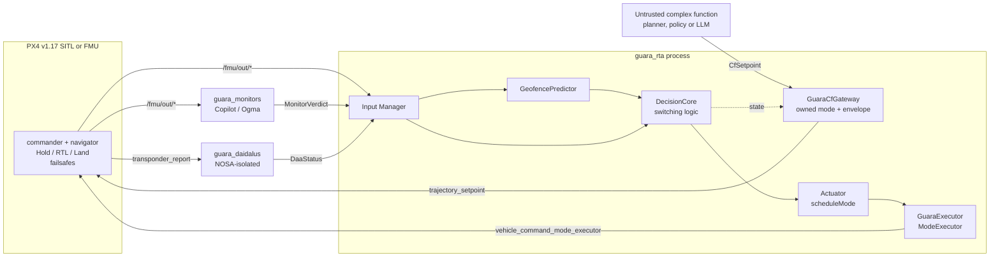

# Architecture and switching logic

The runtime view, the ASTM F3269 role mapping, what the gateway enforces against an
untrusted planner, and the switching core itself. Split out of the README, which links here
from §5. The engineering truth in full is [`SPEC.md`](SPEC.md).

---

## 5.1 ASTM F3269 roles → Guará components

The ASTM F3269 text is not available in this repository; the mapping uses the component names
and is marked [REVIEW] until checked against the licensed standard ([`docs/SPEC.md` §2](SPEC.md)).

| F3269 role | Guará realisation | Package |
|---|---|---|
| Complex Function | External node publishing `guara_msgs/CfSetpoint`; reaches PX4 only through the owned mode `GuaraCfGateway` | out of tree (`guara_cf_*`) |
| Recovery Function | PX4 internal modes Hold / RTL / Land, triggered by `scheduleMode` | PX4 |
| Safety Monitor | Copilot monitors, geofence predictor, DAIDALUS node — each publishing a timestamped verdict | `guara_monitors`, `guara_geofence`, `guara_daidalus` |
| Switching Logic | `DecisionCore` — pure, allocation-free, fixed period `T_s` | `guara_rta` |
| Input Manager | Age and validity checks on every input; gateway that blocks the CF outside state `CF` | `guara_rta` |
| Final layer | PX4 internal failsafes and geofence, deliberately left enabled | PX4 |

## 5.2 Runtime view



## 5.3 What the gateway enforces against an untrusted planner

| Threat | Enforcement | Test |
|---|---|---|
| The planner stalls and a stale setpoint keeps flying | Freshness measured from reception on the gateway clock; implausible stamps rejected | `test_gateway_envelope.cpp` |
| Confident but out-of-envelope command (speed, climb, yaw step) | Clamp to `gateway.max_*`; non-finite rejected | `test_gateway_envelope.cpp` |
| Plausible command that flies at the fence | Shadow check of the proposed velocity against the predictor before forwarding | `test_gateway_envelope.cpp`, AC-9 |
| Unsafe motion re-proposed right after a recovery | Return requires the CF's own intent to be clear | `test_return_policy.cpp` |
| Anti-chattering budget reset by toggling modes | Switch history survives deactivation | `test_return_policy.cpp` |
| Silent death of a monitor or the DAA node | Enabled channels fail closed; undeclared omissions refused | `test_channel_gating.cpp` |
| Structurally malformed or extreme input | Property test against an adversarial CF | `test_gateway_fuzz.cpp` |

Still open before any language model drives a CF, in order: transport authentication on
`/guara/cf/*` and `/fmu/in/*` (SROS2, failure mode FM-12); a jailbreak corpus against the mission
compiler (RQ6b); the RQ5 fuzz corpus extended with future stamps and mode-tool abuse.

---

## 6 · Switching logic

At each tick `k` of period `T_s` the core evaluates the time to loss of well-clear `T_daa`, the
time to geofence violation `T_gf`, the monitor flag `M`, and the input-validity flag `V`:

```
U(k) = [T_daa ≤ τ_daa] ∨ [T_gf ≤ τ_gf] ∨ M(k) ∨ V(k)                          unsafe
C(k) = [T_daa > τ_daa + h_daa] ∧ [T_gf > τ_gf + h_gf] ∧ ¬M(k) ∧ ¬V(k)          clear
```

`U` switches to the recovery function in the same tick. `C` alone does not switch back: the
return demands `C` held continuously for the dwell time `T_d`, a minimum dwell in recovery, and
a switch budget that latches after `N_max` switches in a window `W`. States are `INACTIVE`,
`CF`, `RF(r)` and `LATCHED(r)` with `r ∈ {HOLD, RTL, LAND}`, ranked so escalation is always
permitted and de-escalation never is. The full transition table, the six required properties
P-1…P-6, and the design obligations are in [`docs/SPEC.md` §3](SPEC.md); the rationale for
returning only from Hold is [ADR 0005](adr/0005-return-to-complex-function.md).

The obligation that makes the rule meaningful is **O-1**: `τ_gf ≥ δ_lat` and
`τ_daa ≥ τ_rec,daa + δ_lat`, where `δ_lat` is the *measured* p99 latency from the sample that
makes `U` true to the recovery mode being effective. That is the subject of §7.
