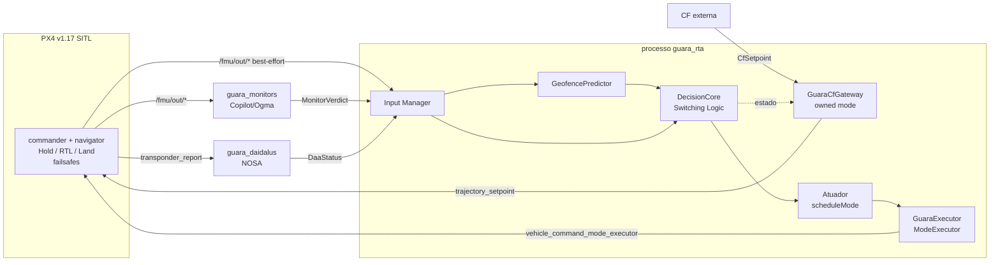

# Guará — Especificação (SPEC)

Versão: 0.1 (P1, 2026-09-11) · Estado: rascunho para revisão humana

Base de versões: PX4 v1.17.0, px4_msgs release/1.17, px4-ros2-interface-lib
release/1.17, ROS 2 Humble, Ogma v1.15.0, DAIDALUS v2.0.3a, Copilot v4.8.1
(`third_party/VERSIONS.md`). Referências `[G x.y]` apontam para linhas de
`GROUNDING.md`; nenhuma API é usada fora dele.

Convenções:
- **[HIPÓTESE]**: valor ou comportamento a medir; nunca usar como resultado.
- **[REVISAR]**: depende de interpretação normativa ou jurídica.
- **[DESCONHECIDO]**: sem evidência; exige P0 ou experimento antes de depender dele.

---

## 1. Escopo

O Guará é uma arquitetura de Runtime Assurance (RTA) para multicópteros PX4 em
simulação (SITL) e, futuramente, em companion computer. Uma função complexa
não confiável (CF) comanda o veículo; um árbitro troca para modos internos do
PX4 (Hold / RTL / Land) quando monitores indicam risco de:

1. violação de geofence prevista;
2. perda de well-clear (DAA) prevista pelo DAIDALUS;
3. violação de requisitos formais (FRETish → Ogma → Copilot);
4. entradas inválidas ou velhas.

Fora de escopo: certificação, hardware real (fase 1), asa fixa/VTOL, seleção
de alvo ou armamento (CLAUDE.md), segurança contra adversários na rede ROS 2.

---

## 2. Mapeamento ASTM F3269 → componentes

O texto da ASTM F3269 **não está disponível no repositório**. O mapeamento usa
os nomes de componentes listados no pacote de prompts do projeto. Números de
cláusula e redação normativa: **[REVISAR]** contra a norma licenciada.

| Componente F3269 | Componente Guará | Processo / pacote | Base técnica |
|---|---|---|---|
| Complex Function (CF) | Nó CF externo (ex.: planejador por intenção textual, P5) que publica `guara_msgs/CfSetpoint`; entra no PX4 **somente** através do owned mode `GuaraCfGateway` | `guara_cf_*` (processo separado) | [G A.4, A.7] |
| Recovery Function (RF) | Modos internos do PX4: Hold (`kModeIDLoiter`), RTL (`kModeIDRtl`), Land (`kModeIDLand`), acionados por `scheduleMode` | PX4 (FMU/SITL) | [G 1.1, 1.2, 1.3] |
| Safety Monitor | (a) monitores Copilot gerados pelo Ogma; (b) preditor de geofence; (c) nó DAIDALUS; cada um publica veredito com carimbo de tempo | `guara_monitors`, `guara_geofence` (biblioteca no árbitro), `guara_daidalus` (NOSA, isolado) | [G 4.1-4.6, 5.1-5.7] |
| Switching Logic | Núcleo de decisão puro (`DecisionCore`), sem alocação, período fixo `T_s`; máquina de estados da §3 | `guara_rta` | CLAUDE.md §Engenharia |
| Input Manager | (a) validação de idade/validade de todas as entradas; (b) gateway que só repassa setpoints da CF quando o estado é `CF` e os bloqueia (substitui por velocidade zero) quando uma troca está pendente | `guara_rta` | [G A.7, A.8, A.13] |
| Camada final (fora do RTA Guará) | Failsafes e geofence internos do PX4 (`GF_ACTION`), permanecem habilitados | PX4 | [G 2.4, A.11] |

Diagrama de processos:



---

## 3. Lógica de chaveamento formal

### 3.1 Sinais (avaliados a cada tick `k`, período `T_s`)

| Símbolo | Definição | Fonte |
|---|---|---|
| `t_k` | instante do tick (relógio monotônico do árbitro) | — |
| `T_daa(k)` | min sobre intrusos do tempo previsto até perda de well-clear, em s; `+∞` sem conflito no lookahead | `DaaStatus` (§ADR-0003; função DAIDALUS a fixar em M5, [G 5.4, 5.5]) |
| `T_gf(k)` | tempo previsto até violação da geofence, em s; `+∞` se não houver violação no horizonte | `GeofencePredictor` (ADR-0004) |
| `M(k)` | `1` se algum monitor da classe `switch` reporta violação | `MonitorVerdict` |
| `a_i(k)` | idade da entrada `i`: `t_k − stamp_i` (conversão de relógio em §4.3) | Input Manager |
| `V(k)` | `1` se ∃ entrada obrigatória com `a_i(k) > A_i`, flag de validade falsa (ex.: `xy_valid`, `v_xy_valid` [G A.8]) ou mensagem ausente | Input Manager |
| `IC(k)` | `1` se o executor está in charge (`isInCharge()` [G 1.6]) | interface-lib |

### 3.2 Parâmetros

| Símbolo | Significado | Valor inicial | Estado |
|---|---|---|---|
| `T_s` | período do núcleo de decisão | 0,05 s | [HIPÓTESE] |
| `δ_lat` | latência ponta a ponta p99, amostra de entrada → RF efetivo (§4) | 0,8 s | [HIPÓTESE] — medir em M7 |
| `τ_rec,gf` | tempo para a RF (Hold) levar a velocidade horizontal a ~0; **já incorporado em `T_gf`** via `d_stop` (ADR-0004), portanto não soma no limiar | derivado de `a_brake` | [HIPÓTESE] — medir `a_brake` em M4 |
| `τ_rec,daa` | tempo para a RF escolhida completar a manobra relevante contra tráfego | 2,0 s | [HIPÓTESE] — medir em M5 |
| `τ_gf` | limiar de disparo por geofence | 1,0 s | [HIPÓTESE]; deve satisfazer O-1 |
| `τ_daa` | limiar de disparo por DAA | 30 s | [HIPÓTESE]; deve satisfazer O-1; depende da configuração DAIDALUS (5.8) |
| `h_gf`, `h_daa` | histerese aditiva (s) no retorno | 1,0 s / 5,0 s | [HIPÓTESE] |
| `T_d` | dwell mínimo na RF e tempo contínuo de condição limpa antes do retorno | 5,0 s | [HIPÓTESE] |
| `A_i` | idade máxima por entrada | `vehicle_local_position_v1`: 0,2 s; `MonitorVerdict`: 0,5 s; `DaaStatus`: 1,0 s; `vehicle_status_v1`: 1,0 s | [HIPÓTESE] |
| `N_max`, `W` | máximo de chaveamentos CF→RF numa janela deslizante antes de travar | 3 em 120 s | [HIPÓTESE] |
| `H_max` | idade máxima do heartbeat do núcleo antes do auto-reporte de falha (§5, FM-4) | 0,25 s | [HIPÓTESE] |

Os valores ficam em `config/rta_params.yaml`; toda execução copia o arquivo
para `results/{run_id}/config.yaml`.

### 3.3 Obrigações de projeto (verificadas por medição, não por prova)

- **O-1 (margem temporal):** `τ_gf ≥ δ_lat` (a frenagem já está em `T_gf`, ADR-0004)
  e `τ_daa ≥ τ_rec,daa + δ_lat`, com `δ_lat` = p99 medido em M7 e `τ_rec,daa`, `a_brake` medidos em SITL.
  Com os valores iniciais (`τ_gf = 1,0 s`, `δ_lat = 0,8 s`) a folga é 0,2 s (4·`T_s`);
  AC-22 decide com `δ_lat` medido.
- **O-2 (resolução):** `T_s ≤ min(A_i)/2`, para que dados velhos sejam detectados em ≤ 2 ticks.
- **O-3 (assimetria):** nenhum atraso intencional (histerese ou dwell) é aplicado no sentido CF→RF.

### 3.4 Predicados

```
U(k)  = [T_daa(k) ≤ τ_daa] ∨ [T_gf(k) ≤ τ_gf] ∨ M(k) ∨ V(k)          (inseguro)
C(k)  = [T_daa(k) > τ_daa + h_daa] ∧ [T_gf(k) > τ_gf + h_gf] ∧ ¬M(k) ∧ ¬V(k)   (limpo)
Cdur(k) = duração contínua (s) até t_k em que C é verdadeiro; 0 se C(k) falso
S(k)  = número de transições CF→RF em (t_k − W, t_k]
```

`C ⇒ ¬U` por construção (`h ≥ 0`); a faixa entre os limiares é a histerese.

### 3.5 Máquina de estados

Estados: `INACTIVE`, `CF`, `RF(r)`, `LATCHED(r)`; `r ∈ {HOLD, RTL, LAND}`.

| # | De | Condição (avaliada em ordem) | Para | Ação |
|---|---|---|---|---|
| T1 | qualquer | `¬IC(k)` | `INACTIVE` | nenhum comando é emitido (autoridade humana/PX4 [G 1.6]) |
| T2 | `INACTIVE` | `IC(k)` ∧ owned mode ativo ∧ `¬U(k)` | `CF` | gateway libera setpoints da CF |
| T2b | `INACTIVE` | `IC(k)` ∧ owned mode ativo ∧ `U(k)` | `RF(select(k))` | igual a T3 (preserva P-2 na ativação) |
| T3 | `CF` | `U(k)` | `RF(select(k))` | gateway bloqueia CF no mesmo tick; atuador agenda `r`; registra `t_sw` |
| T4 | `RF(r)` | `S(k) ≥ N_max` | `LATCHED(r)` | nenhum retorno até `¬IC` |
| T5 | `RF(HOLD)` | `C(k)` ∧ `Cdur(k) ≥ T_d` ∧ `t_k − t_sw ≥ T_d` ∧ `return_enabled` | `CF` | atuador agenda owned mode |
| T6 | `RF(r)` | `U(k)` ∧ `rank(select(k)) > rank(r)` | `RF(select(k))` | escalonamento (ADR-0005) |
| T7 | `LATCHED(r)` | `U(k)` ∧ `rank(select(k)) > rank(r)` | `LATCHED(select(k))` | escalonamento permitido, retorno não |

`select(k)` (política v1, [HIPÓTESE], ADR-0005):

| Causa verdadeira em `k` | `r` |
|---|---|
| `V(k)` (entradas velhas/invalidas) | HOLD |
| `T_gf ≤ τ_gf` | HOLD |
| `T_daa ≤ τ_daa` | HOLD |
| `M(k)` | ação configurada por monitor ∈ {HOLD, RTL, LAND}; padrão HOLD |
| várias | maior `rank`: `HOLD < RTL < LAND` |

Propriedades exigidas do `DecisionCore` (testáveis em unidade, AC-4..AC-6, AC-12, AC-13):

- **P-1:** `U(k) ∧ estado=CF ⇒ estado(k)=RF` no mesmo tick.
- **P-2:** estado `CF` em `k` ⇒ `¬U(k)`.
- **P-3:** retorno `RF→CF` em `k` ⇒ `C` contínuo em `[t_k − T_d, t_k]` e `t_k − t_sw ≥ T_d`.
- **P-4:** número de transições CF→RF em qualquer janela `W` ≤ `N_max`.
- **P-5:** o núcleo não aloca memória dinâmica após a inicialização e executa em tempo máximo observado ≤ `B_dec` = 1 ms [HIPÓTESE] em x86-64 do container.
- **P-6:** `¬IC(k)` ⇒ nenhum comando emitido a partir de `k`.

---

## 4. Orçamento de latência

### 4.1 Decomposição

Caminho medido: amostra que torna `U` verdadeiro → RF efetivo no PX4.

| Etapa | Símbolo | Início (carimbo) | Fim (carimbo) | Fonte do carimbo | Valor inicial |
|---|---|---|---|---|---|
| Amostragem → publicação uORB | `L0` | `timestamp_sample` | `timestamp` | campos da mensagem PX4 [G A.8] | [HIPÓTESE] 0,02 s |
| Transporte DDS PX4 → ROS 2 | `L1` | `timestamp` (+offset) | recepção no nó | callback ROS 2 [G A.9] | [HIPÓTESE] 0,02 s |
| Processamento do monitor (Copilot/geofence/DAIDALUS) | `L2` | recepção | publicação do veredito | `MonitorVerdict.stamp` / `DaaStatus.stamp` | [HIPÓTESE] 0,05 s (DAA 0,2 s) |
| Transporte do veredito até o árbitro | `L3` | publicação do veredito | recepção no árbitro | callback | [HIPÓTESE] 0,01 s |
| Decisão (espera do tick + cálculo) | `L4` | recepção no árbitro | transição T3 | `RtaEvent.t_decide` | ≤ `T_s` + `B_dec` |
| Comando → aceito pelo commander | `L5` | publicação `VehicleCommand` | `vehicle_command` na ULog | ULog [G A.10] | [HIPÓTESE] 0,05 s |
| Aceito → modo efetivo | `L6` | `vehicle_command` na ULog | mudança de `nav_state` em `vehicle_status` na ULog | ULog [G A.10] | [HIPÓTESE] 0,1 s |

`δ_lat = L0 + L1 + L2 + L3 + L4 + L5 + L6` (p50 e p99 por etapa e total).
A soma das hipóteses é ~0,30 s (~0,45 s no caminho DAA, com `L4` no pior caso
de `T_s`); `δ_lat` inicial = 0,8 s inclui folga. Tudo **[HIPÓTESE]** até M7.

### 4.2 Regras de medição

- Observação de modo **não** usa `/fmu/out/vehicle_status_v1` (limitado a 5 Hz [G 3.7]); `L6` vem da ULog.
- O bloqueio do `sendCommandSync` (até ~3,9 s [G A.1]) **não** entra em `L5`: o comando é publicado antes da espera. O tempo até ACK é registrado à parte como `L5_ack`.
- `RtaEvent` registra `t_input_stamp`, `t_recv`, `t_decide`, `t_cmd_pub`, `t_ack`, com relógio declarado.
- Métricas saem apenas de `scripts/aggregate.py` → `results/{run_id}/metrics.json` (CLAUDE.md).

### 4.3 Alinhamento de relógios

`timestamp` recebe o offset de sincronização da sessão uXRCE [G A.9]. Qual
relógio ROS 2 isso produz (sistema vs. sim time) é **MÉDIA**; AC-19 mede o erro
de alinhamento antes de qualquer latência cross-process ser reportada. Enquanto
AC-19 não passar, só são válidas latências medidas em um mesmo relógio (`L4`,
`L5_ack`, e `L6` inteiramente na ULog).

---

## 5. Modos de falha do árbitro e reação do PX4

| ID | Falha | Detecção | Reação do PX4 / do sistema | Evidência | Confiança | Verificação |
|---|---|---|---|---|---|---|
| FM-1 | Processo `guara_rta` termina (crash/kill) com owned mode (CF) ativo | PX4: sem resposta ao arming check; unresponsive após >3 requisições perdidas (~1,2 s) | `mode_req_other` → modo não pode rodar → RTL (sem atraso `COM_FAIL_ACT_T`). Comportamento dos controladores durante a janela sem setpoints: **[DESCONHECIDO]** | [G 2.1-2.4, 2.10] | MÉDIA | AC-15 |
| FM-2 | Processo termina com RF (Hold/RTL/Land) ativo | Nenhuma detecção pelo PX4 (modo interno) | Modo interno continua; failsafes do PX4 seguem ativos; não há retorno à CF | [G 2.6] | MÉDIA | AC-15b |
| FM-3 | Reinício do árbitro em voo | — | Registro rejeitado com veículo armado (`COM_MODE_ARM_CHK=0`): Guará fica indisponível até pousar/desarmar | [G 2.7] | ALTA | AC-15c |
| FM-4 | Thread de decisão trava, callbacks do nó seguem vivos | Owned mode verifica heartbeat do núcleo em `checkArmingAndRunConditions`; idade > `H_max` ⇒ `armingCheckFailureExt` | `can_arm_and_run=false` → mesma cadeia do FM-1 (RTL), latência ≤ ~300 ms + processamento | [G A.4-A.6] | MÉDIA | AC-16 |
| FM-5 | Executor ROS 2 inteiro trava (thread única) | Igual FM-1 | Igual FM-1 | [G 2.1-2.4, A.5] | MÉDIA | AC-16b |
| FM-6 | Dados de entrada velhos, ausentes ou inválidos | Input Manager: `V(k)` | Guará: T3 → HOLD. PX4 desconhece a condição | §3.1 | — (projeto) | AC-17 |
| FM-7 | Atuador bloqueado em `sendCommandSync` (até ~3,9 s) ou comando sem ACK (`Result::Timeout`) | Resultado do callback | Comando já publicado; gateway mantém setpoint de velocidade zero enquanto `RF` pendente; nova tentativa a cada tick até `N_retry` [HIPÓTESE 3]; depois `LATCHED` + evento crítico | [G A.1] | ALTA (bloqueio); MÉDIA (mitigação) | AC-21 |
| FM-8 | Piloto/GCS troca de modo | `onDeactivate(Other)` | Guará vai a `INACTIVE` e para de comandar (autoridade humana) | [G 1.6, A.3] | ALTA | AC-14 |
| FM-9 | PX4 entra em failsafe | `onDeactivate(FailsafeActivated)` | Guará vai a `INACTIVE`; failsafes **nunca** são adiados pelo Guará | [G 1.8] | ALTA | AC-20 |
| FM-10 | Monitor/requisito incorreto (falso negativo) | Não detectável pelo árbitro | Nenhuma; ver §7 | — | — | revisão P3 + P6 |
| FM-11 | Relógios desalinhados | AC-19 | Idades `a_i` erradas → falsos `V` ou dados velhos aceitos | [G A.9] | MÉDIA | AC-19 |
| FM-12 | Outro nó publica em `/fmu/in/trajectory_setpoint` contornando o gateway | Não detectável pelo árbitro | PX4 não autentica origem; fora do modelo de ameaça | [G A.13] | ALTA (formato) | — (§7) |

---

## 6. Critérios de aceite

Convenções: comandos rodam na raiz do repositório dentro do container de
desenvolvimento (`./scripts/dev.sh <cmd>`, criado em M1). `results/latest` é
link para a última execução. Um AC só passa com comando executado + trecho da
saída no relatório do milestone.

| AC | Milestone | Critério (passa se…) | Comando de verificação |
|---|---|---|---|
| AC-1 | M1 | Workspace compila do zero sem erros | `./scripts/dev.sh colcon build --symlink-install` (exit 0) |
| AC-2 | M1 | SITL headless executa cenário e grava `config.yaml` (seed, commits de `third_party/VERSIONS.md`, SHA do Guará) e `.ulg` | `./scripts/sitl_run.sh --scenario hover --seed 42 --headless && python3 scripts/check_run_contract.py results/latest` |
| AC-2b | M1 | Duas execuções com a mesma seed produzem o mesmo `config.yaml` (exceto `run_id`/data) | `python3 scripts/check_reproducible.py --scenario hover --seed 42 --runs 2` |
| AC-3 | M2 | Monitor Ogma/Copilot recebe `/fmu/out/vehicle_local_position_v1` com QoS best-effort e publica violação no cenário de altitude | `./scripts/sitl_run.sh --scenario alt_ceiling_violation --seed 42 --headless && python3 scripts/check_ac.py AC-3 results/latest` |
| AC-3b | M2 | Template Ogma próprio usa QoS compatível com PX4 [G 4.5] | `colcon test --packages-select guara_monitors --ctest-args -R qos_profile` |
| AC-4 | M3 | Propriedades P-1, P-2, P-6 sobre tabela-verdade exaustiva de (`U`, `C`, `IC`, estado) | `colcon test --packages-select guara_rta --ctest-args -R decision_core_truth_table` |
| AC-5 | M3 | P-5 (sem alocação): contador de `operator new` = 0 durante 10⁶ ticks após init | `colcon test --packages-select guara_rta --ctest-args -R decision_core_no_alloc` |
| AC-6 | M3 | P-5 (tempo): tempo máximo observado por tick ≤ `B_dec` em 10⁶ entradas aleatórias com seed fixa (medição, não WCET provado) | `colcon test --packages-select guara_rta --ctest-args -R decision_core_timing` |
| AC-7 | M3 | Em SITL, gatilho de monitor injetado leva `nav_state` a `AUTO_LOITER`; latência `L6` extraída da ULog | `./scripts/sitl_run.sh --scenario monitor_trigger_hold --seed 42 --headless && python3 scripts/check_ac.py AC-7 results/latest` |
| AC-8 | M4 | `GeofencePredictor` retorna `T_gf` dentro de ±0,05 s em casos analíticos (polígonos convexos e côncavos, velocidade nula, trajetória tangente) e `+∞` quando não há violação | `colcon test --packages-select guara_geofence --ctest-args -R predictor_analytic` |
| AC-9 | M4 | Cenário `gf_straight_concave` seed 42: com RTA, profundidade máxima de violação = 0 m; sem RTA (mesma seed), violação > 0 m (valida que o cenário exercita a geofence) | `./scripts/sitl_pair.sh --scenario gf_straight_concave --seed 42 && python3 scripts/check_ac.py AC-9 results/latest_pair` |
| AC-10 | M5 | `guara_daidalus` publica `DaaStatus` a partir de `transponder_report`; `T_daa` coincide (±0,1 s) com o DAIDALUS standalone nas mesmas entradas gravadas | `colcon test --packages-select guara_daidalus --ctest-args -R daa_equivalence` |
| AC-11 | M5 | Nenhum pacote fora de `nosa/` depende (`package.xml`/CMake) ou inclui cabeçalhos do DAIDALUS | `python3 scripts/check_license_isolation.py` |
| AC-12 | M6 | P-3: sinal com oscilação em torno de `τ` nunca causa retorno antes de `T_d`; histerese impede retorno enquanto `T ≤ τ + h` | `colcon test --packages-select guara_rta --ctest-args -R hysteresis_dwell` |
| AC-13 | M6 | P-4: após `N_max` chaveamentos em `W`, estado vai a `LATCHED` e não retorna | `colcon test --packages-select guara_rta --ctest-args -R latch_policy` |
| AC-14 | M3 | Troca de modo pelo "piloto" (comando MAVLink simulado) ⇒ `INACTIVE` e zero comandos do executor depois (P-6) | `./scripts/sitl_run.sh --scenario pilot_override --seed 42 --headless && python3 scripts/check_ac.py AC-14 results/latest` |
| AC-15 | M3 | FM-1: `kill -9` do árbitro com CF ativa ⇒ `nav_state = AUTO_RTL` na ULog; tempo de detecção registrado em `metrics.json` | `./scripts/sitl_run.sh --scenario kill_arbiter_in_cf --seed 42 --headless && python3 scripts/check_ac.py AC-15 results/latest` |
| AC-15b | M3 | FM-2: `kill -9` com Hold ativo ⇒ Hold mantido até o fim do cenário (confirma ou refuta [G 2.6]) | `./scripts/sitl_run.sh --scenario kill_arbiter_in_hold --seed 42 --headless && python3 scripts/check_ac.py AC-15b results/latest` |
| AC-15c | M3 | FM-3: reinício armado ⇒ registro rejeitado, evento registrado | `./scripts/sitl_run.sh --scenario restart_arbiter_armed --seed 42 --headless && python3 scripts/check_ac.py AC-15c results/latest` |
| AC-16 | M3 | FM-4: travamento injetado da thread de decisão ⇒ PX4 sai do owned mode (RTL) | `./scripts/sitl_run.sh --scenario hang_decision_thread --seed 42 --headless && python3 scripts/check_ac.py AC-16 results/latest` |
| AC-16b | M3 | FM-5: travamento do executor ROS 2 inteiro ⇒ RTL | `./scripts/sitl_run.sh --scenario hang_ros_executor --seed 42 --headless && python3 scripts/check_ac.py AC-16b results/latest` |
| AC-17 | M3 | FM-6: supressão de `vehicle_local_position_v1` por > `A_i` ⇒ HOLD em ≤ 2 ticks após expirar `A_i` (registro `RtaEvent`) | `./scripts/sitl_run.sh --scenario stale_local_position --seed 42 --headless && python3 scripts/check_ac.py AC-17 results/latest` |
| AC-18 | M7 | Relatório com p50/p99 de `L0..L6` e `δ_lat` a partir de ≥ 30 execuções [HIPÓTESE de tamanho]; toda etapa presente; números só de `metrics.json` | `python3 scripts/aggregate.py results/batch_latency && python3 scripts/check_ac.py AC-18 results/batch_latency` |
| AC-19 | M7 | Erro de alinhamento de relógio PX4↔ROS 2 medido e reportado (p99); latências cross-process só aparecem se p99 < 10 ms [HIPÓTESE] | `python3 scripts/check_ac.py AC-19 results/batch_latency` |
| AC-20 | M3 | Código do Guará nunca habilita adiamento de failsafe | `! grep -rn "deferFailsafesSync *( *true" ros2_ws/src` |
| AC-21 | M3 | FM-7: com atuador simulado bloqueando/sem ACK, gateway publica velocidade zero desde o tick de T3 e CF é descartada | `colcon test --packages-select guara_rta --ctest-args -R gateway_blocks_cf` |
| AC-22 | M4-M6 | Obrigação O-1 verificada com `δ_lat` e `τ_rec` medidos; relatório indica se os parâmetros escolhidos a satisfazem | `python3 scripts/check_ac.py AC-22 results/batch_latency` |

Os scripts e cenários citados são entregáveis dos milestones indicados; não existem ainda.

---

## 7. O que o Guará NÃO garante

1. **Não é certificação** nem demonstra conformidade com ASTM F3269, DO-365 ou
   regulamentação brasileira. O alinhamento com a F3269 é arquitetural e [REVISAR].
2. **Não garante evitar colisão nem manter well-clear.** A RF v1 para DAA é
   Hold: parar não afasta o veículo de um intruso convergente. O Guará só
   garante (sob O-1 medida) que a troca ocorre antes do tempo previsto de perda.
3. **Não garante ausência de violação de geofence** sob vento acima do
   modelado, erro de estimativa de posição (`eph`) acima do modelado, ou
   `τ_rec,gf` subestimado.
4. **Não sobrevive à própria falha em todos os casos:** com RF interna ativa,
   a morte do árbitro não é detectada pelo PX4 (FM-2); o árbitro não volta em
   voo (FM-3); durante a janela de ~1,2 s do FM-1 o comportamento dos
   controladores é [DESCONHECIDO].
5. **Não protege contra entradas falsificadas** (GPS spoofing, ADS-B falso,
   tráfego não cooperativo sem transponder) nem contra nós maliciosos na rede
   ROS 2 (FM-12). A DDS não é autenticada nesta fase.
6. **Não detecta erros nos requisitos:** monitores Copilot verificam o que foi
   especificado; formalização incorreta de FRETish passa despercebida (FM-10).
7. **O árbitro roda fora do FMU** (companion/SITL): não tem as garantias de
   tempo real nem o isolamento do autopiloto; latências são medidas, não limitadas.
8. **Resultados de SITL não se transferem automaticamente** a voo real
   (dinâmica, sensores, rede, carga de CPU).
9. **O tempo de decisão é medido, não provado** (P-5); não há análise de WCET.
10. **O CopilotVerifier**, se usado, cobre o C gerado pelo Copilot, não o glue
    C++/ROS nem o árbitro [G 6.4].
11. **Não substitui os failsafes do PX4**; se o PX4 entra em failsafe, o Guará
    se retira (FM-9).

---

## 8. Rastreabilidade

| Seção | ADR | ACs |
|---|---|---|
| §2 arquitetura | 0001, 0002 | AC-1, AC-2 |
| §3 chaveamento | 0005 | AC-4..AC-6, AC-12, AC-13, AC-22 |
| §3.1 `T_gf` | 0004 | AC-8, AC-9 |
| §3.1 `T_daa` | 0003 | AC-10, AC-11 |
| §4 latência | 0001 | AC-7, AC-18, AC-19 |
| §5 falhas | 0001 | AC-14..AC-17, AC-20, AC-21 |

---

## 9. Riscos abertos (fim do P1)

| # | Risco | Impacto | Ação / onde se resolve |
|---|---|---|---|
| R-1 | Comportamento dos controladores PX4 na janela de ~1,2 s sem setpoints após crash do árbitro (FM-1) é [DESCONHECIDO] | Deriva do veículo antes do RTL | AC-15 em M3; se inaceitável, reavaliar ADR 0001 |
| R-2 | Morte do árbitro com Hold ativo não é detectada (FM-2); inferência por ausência de código | Veículo parado indefinidamente sem árbitro | AC-15b em M3 |
| R-3 | `sendCommandSync` aloca e bloqueia até ~3,9 s [G A.1]; mitigação por thread de atuação separada não testada | Atraso de escalonamento; violação da regra de caminho limitado se mal isolado | AC-5, AC-21 em M3 |
| R-4 | Alinhamento de relógio PX4↔ROS 2 [G A.9] é MÉDIA | Latências cross-process e idades `a_i` erradas | AC-19 antes de publicar qualquer `δ_lat` |
| R-5 | Configuração DO-365B (lookahead 180 s, 0,66 nmi) inadequada para drones pequenos; função DAIDALUS para "perda de well-clear" ainda não fixada [G 5.5, 5.8] | `T_daa` sem significado operacional | ADR complementar em M5 com fonte para os limiares ([PARÂMETRO A DEFINIR]) |
| R-6 | RF=Hold não resolve conflito com intruso convergente (§7 item 2) | Resultado DAA fraco / overclaiming | Declarar no paper; avaliar escalonamento em M6 |
| R-7 | Injeção de tráfego no SITL depende de MAVLink `ADSB_VEHICLE` ou `fake_traffic` [G 3.3]; nenhum dos dois exercitado | M5/P4 bloqueados | Novo P0 curto no início de M5 |
| R-8 | Texto da ASTM F3269 indisponível; mapeamento §2 não conferido | Terminologia/claims incorretos | Revisão humana com a norma [REVISAR] |
| R-9 | Interpretação jurídica NOSA × Apache-2.0/BSD e licença do próprio Guará não definidas [G A.12] | Bloqueia distribuição de containers e P7 | Revisão humana; ADR 0003 item 7 |
| R-10 | Fluxo FRET → Ogma não verificado [G 4.7] | P3/M2 podem precisar de conversão manual | Novo P0 curto no início de M2 |
| R-11 | Ambiente: 7,9 GB livres em disco; daemon Docker parado; sem toolchain Haskell/LLVM/z3 | M1 e CopilotVerifier bloqueados | Liberar disco e iniciar Docker antes de M1 |
| R-12 | Todos os parâmetros de §3.2 e etapas de §4.1 são [HIPÓTESE] | Nenhum número publicável até M7 | AC-18, AC-22 |
| R-13 | Nomes de cenário e scripts citados nos ACs ainda não existem | ACs podem mudar de forma na implementação | Mudanças registradas no relatório do milestone, sem alterar o critério |
