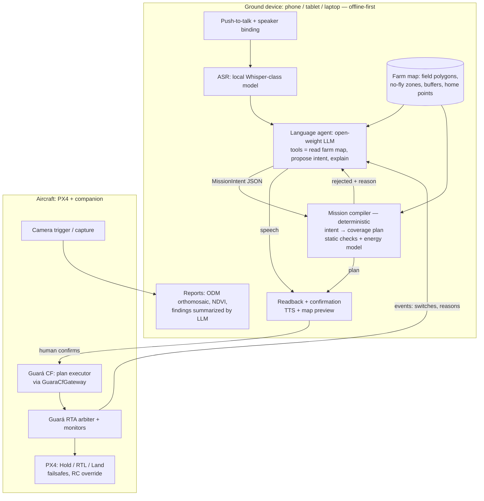

# LLM embodiment of drones — limitations and solution design

Status: research draft (2026-09-11). Not a SPEC. Nothing here is a result; external
numbers are attributed to their sources and are not Guará measurements.

## 1. Problem

> An owner tells the drone, by voice, what to do ("survey the north soybean field and show me
> where it looks sick"). The drone plans, flies, collects images and areas, and talks back —
> locally in the field or remotely — like a robot that flies.

Target users: farmers, agronomists, cooperatives, small service providers. Open source,
open weights, auditable, usable offline in rural areas.

## 2. Is this "first of a kind"? Honest positioning

Natural-language drone control is **not** new:

| Work | What it does | Safety basis |
|---|---|---|
| ChatGPT for Robotics / PromptCraft (Microsoft, 2023) | LLM writes code over a drone function library in AirSim | Human reviews code |
| TypeFly (2023, IEEE TMC 2025) | LLM emits MiniSpec, a token-efficient DSL, stream-interpreted | DSL restricts actions |
| Taking Flight with Dialogue (2025) | PX4 + ROS 2 + Ollama local LLMs/VLMs, sim + real quadcopter | Not specified in abstract |
| EchoPilot (2025) | Voice → LangGraph → MCP → MAVSDK → PX4, local Ollama | Telemetry verification; author asks for safety ideas |
| MAVLinkMCP, ardupilot-mcp | MCP servers exposing MAVLink to LLM agents | SITL-first, "safety-gated", human in loop |
| Universal LLM–Drone C2 interface (UC Irvine, 2026) | MCP + MAVSDK, many LLMs, sub-250 g real drone in cage | "Human in the loop for manual override"; non-determinism acknowledged |
| AerialClaw (2026) | Brain–skill–runtime agent framework, PX4 SITL/AirSim | "Safety-oriented runtime validation" (unspecified) |

Common pattern: safety = prompt engineering + tool restriction + human override.
None found uses a **formally specified, measured runtime-assurance boundary** (F3269-style) between the
LLM and the autopilot.

Defensible novelty claim (still [REVIEW] until a systematic literature search in P6):
**an open-source, open-weight, voice-driven drone agent whose physical authority is bounded by a
formally specified RTA with measured latency and verified monitors, targeting a real regulatory
framework (RBAC 100 / MAPA Portaria 298).** That is exactly Guará + a language layer.

## 3. Limitations inventory

### 3.1 Guará itself (inherited, see SPEC §7 and §9)

| # | Limitation | Source |
|---|---|---|
| L-G1 | Arbiter on companion, not high-assurance; FM-2 (dead arbiter in Hold undetected), FM-3 (no re-register in flight) | SPEC §5, [G 2.6, 2.7] |
| L-G2 | All thresholds and latencies are hypotheses until M7 | SPEC R-12 |
| L-G3 | DAA recovery is Hold — does not resolve converging traffic (agricultural aircraft!) | SPEC §7.2, R-6 |
| L-G4 | DAIDALUS config sized for large aircraft; pin behind upstream | SPEC R-5, R-14 |
| L-G5 | Non-cooperative traffic (no ADS-B) invisible; spoofing not handled | SPEC §7.5 |
| L-G6 | ROS 2 DDS unauthenticated — any node can publish setpoints | [G A.13], FM-12 |
| L-G7 | SITL only; no transfer guarantee | SPEC §7.8 |
| L-G8 | Monitors cover specified physical properties only; mission-level mistakes pass | SPEC §7.6, §7.12 |
| L-G9 | Open blockers: executor-death timing, FRET→Ogma run, CopilotVerifier toolchain | GROUNDING status table, R-11 |

### 3.2 Language model

| # | Limitation | Why it matters in flight |
|---|---|---|
| L-M1 | Hallucination and non-determinism | Same sentence can yield different plans; wrong field, wrong altitude |
| L-M2 | Token-by-token generation latency | TypeFly was built specifically to cut plan latency; an LLM cannot sit in a control loop |
| L-M3 | Weak metric/spatial reasoning | "50 m left of the barn" requires grounding in a map, not language |
| L-M4 | Long-horizon drift | UC Irvine interface reports conflicting commands and missions limited to minutes |
| L-M5 | Jailbreaks | RoboPAIR reports 100% jailbreak rate against three LLM-controlled robots |
| L-M6 | Indirect prompt injection via perception | A VLM reading signs, labels or QR codes in the field is an input channel for an attacker |
| L-M7 | Portuguese/rural vocabulary, crop and agronomic terms | Open models are weaker outside English; misclassification of intent |
| L-M8 | Model licenses | "Open weights" licenses vary (some restrict use/scale); must be checked per model [REVIEW] |

### 3.3 Voice

| # | Limitation | Note |
|---|---|---|
| L-V1 | Rotor noise makes onboard ASR impractical for commanding | Put the microphone on the ground device (phone/tablet/radio), not the drone |
| L-V2 | Accents, wind noise outdoors, code-switching | Needs field-recorded evaluation set |
| L-V3 | Inaudible/adversarial audio (DolphinAttack) | Voice is an attack surface; commands must be confirmed and authenticated |
| L-V4 | Who is speaking? | Any bystander could command the aircraft without speaker binding / push-to-talk |
| L-V5 | Ambiguity and deixis ("there", "that part") | Needs map/touch disambiguation and explicit readback |
| L-V6 | TTS stack churn | Piper was archived Oct 2025 (moved to Open Home Foundation fork) — dependency risk |

### 3.4 Compute, energy, connectivity

| # | Limitation | Note |
|---|---|---|
| L-C1 | Onboard LLM costs mass and power → flight time | Keep LLM on the ground in phases 1–2 |
| L-C2 | Rural connectivity gaps | Cloud LLM cannot be a dependency; offline-first |
| L-C3 | Link loss mid-mission | Plan must be fully uploaded and executable without the LLM; RC/PX4 link-loss failsafe stays |
| L-C4 | Edge hardware variance | Reported local voice-assistant latencies range from ~1–2 s (desktop GPU) to 5–8 s (Raspberry Pi 5) per community write-ups — acceptable for mission dialog, never for control |

### 3.5 Perception and agronomy

| # | Limitation | Note |
|---|---|---|
| L-P1 | "Looks sick" is not a measurement | VLM opinions ≠ agronomic diagnosis; need indices (NDVI/NDRE) + calibrated sensors + agronomist sign-off |
| L-P2 | Photogrammetry is batch and slow | OpenDroneMap produces orthomosaics/indices offline, not in flight |
| L-P3 | Radiometric calibration, georeferencing error | Without calibration, index maps are not comparable across flights |
| L-P4 | No public benchmark for voice→agro mission | Must be built (BR-UAS-Bench extension) |

### 3.6 Regulation, liability, privacy (Brazil first) [REVIEW]

| # | Limitation | Note |
|---|---|---|
| L-R1 | RBAC 100 (in force 2026-06-16) classifies by operational risk: Open / Specific / Certified | Voice-commanded autonomy likely pushes toward Specific with risk assessment |
| L-R2 | BVLOS needs specific authorization via DECEA/SARPAS | Phase 1 must be VLOS |
| L-R3 | Spraying/solids: MAPA Portaria 298/2021 — SIPEAGRO registration, CAAR course or responsible agronomist, per-application records, 20 m buffers | **Keep spraying out of scope** in phases 1–3; survey/imaging only |
| L-R4 | Remote pilot remains responsible | The LLM cannot be the pilot in command; a certified human is |
| L-R5 | LGPD: imagery of neighbors, people, houses | Data minimization, on-device storage, retention policy |
| L-R6 | Market is ~84% DJI (closed) | Guará needs PX4; target open airframes or PX4 retrofits; DJI SDK integration is out of scope |

### 3.7 Human factors

| # | Limitation | Note |
|---|---|---|
| L-H1 | Over-trust in a talking machine | Talk-back must state uncertainty and what was *not* checked |
| L-H2 | Mode confusion (who is flying?) | Always announce RTA interventions and mode changes by voice |
| L-H3 | Intent vs safety | "Keep going" is not permission to ignore an RTA switch (ADR 0005 T5 still applies) |

## 4. Design principle

**The LLM proposes, a deterministic compiler disposes, the RTA enforces, PX4 falls back, the human commands.**

The LLM is treated as the adversarial complex function of RQ5: its output is untrusted data.
It never emits setpoints, MAVLink, or code. It emits a typed, bounded **Mission Intent**.

## 5. Architecture



### 5.1 Layers and trust

| Layer | Trust | Can it move the aircraft? | Failure handled by |
|---|---|---|---|
| Human (remote pilot) | Authority | Yes (RC/GCS override) | Regulation, training |
| ASR | Untrusted | No | Readback + confirmation |
| LLM agent | Untrusted | No | Mission compiler rejects; RQ5-style testing |
| Mission compiler | Trusted, deterministic, unit-tested | No (produces a plan) | Tests + static property checks |
| Guará CF (plan executor) | Untrusted by RTA | Only through gateway | RTA |
| Guará RTA | Assured (measured, verified monitors) | Switches to RF | PX4 fallback (FM-1..FM-5) |
| PX4 | Assured baseline | Yes | Internal failsafes |

### 5.2 Mission Intent (sketch, v0)

Closed vocabulary; everything else is rejected.

```json
{
  "intent": "survey",               // survey | inspect_point | return_home | land_now | status | abort
  "field_id": "north-3",            // must exist in farm map
  "sensor": "rgb",                  // rgb | multispectral | thermal
  "gsd_cm": 3.0,                    // bounded by compiler table
  "overlap": {"front": 0.75, "side": 0.65},
  "altitude_agl_m": null,           // null = compiler derives from gsd; clamp to regulatory max
  "deliver": ["orthomosaic", "ndvi"],
  "utterance_hash": "sha256:…"      // audit link to the recorded command
}
```

Safety-relevant commands (`abort`, `land_now`, `return_home`) bypass the LLM: keyword grammar on the
ASR output + physical button, mapped directly to PX4 modes. The LLM path is never required to stop.

### 5.3 Mission compiler checks (pre-flight, deterministic)

- Coverage polygon ⊆ field polygon ⊖ buffers ⊆ geofence loaded into Guará **and** PX4 (same file, hashed — ADR 0004).
- Altitude ≤ configured regulatory ceiling [PARAMETER TBD from RBAC 100].
- Energy: planned path length × consumption model + reserve ≤ battery budget [HYPOTHESIS model].
- VLOS: every waypoint within configured VLOS radius of the pilot position.
- Output plan is the only input to the CF; the RTA monitors the *flight*, the compiler checks the *plan*.
  Two independent layers, like ADR 0004's Guará + PX4 geofence.

### 5.4 Deployment modes

| Mode | Where LLM/ASR run | Link needed | Phase |
|---|---|---|---|
| Local | Ground laptop / edge GPU in the truck | Only RC/telemetry | 1–2 |
| Remote | Ground node at farm office; operator connects over 4G/satellite | Operator ↔ ground node; aircraft still controlled locally | 2 |
| Onboard assist | Small model on companion for talk-back/status only | None | 3 (after power budget study) |

## 6. Limitation → mitigation map

| Limitation | Mitigation | Verified by |
|---|---|---|
| L-M1, L-M3, L-M4 | Closed intent schema; map-grounded field IDs; compiler rejects; LLM out of control loop | Intent accuracy eval (RQ6a) |
| L-M2, L-C4 | LLM only at mission level; stop commands bypass LLM | Latency of stop path measured (RQ6d) |
| L-M5, L-M6 | Treat LLM as adversarial CF; compiler + RTA independent of LLM; no VLM text read as instructions | Jailbreak corpus (PT/EN) against compiler (RQ6b); RQ5 |
| L-M7 | Evaluate models on Portuguese agro command set; fine-tune only if needed | RQ6a per language |
| L-V1..L-V5 | Ground mic, push-to-talk, speaker binding, readback + explicit confirm, map disambiguation | Field audio test set |
| L-C1..L-C3 | Offline-first, plan fully uploaded, PX4 link-loss failsafe unchanged | SITL link-drop scenario (P4 degradations) |
| L-P1..L-P3 | Indices from calibrated sensors via ODM; LLM summarizes, agronomist decides | Report contains method + uncertainty |
| L-R1..L-R6 | VLOS, survey-only scope, human PIC, LGPD policy, PX4 airframes | Regulatory review [REVIEW] |
| L-H1..L-H3 | Voice announcements of every RTA switch with reason; uncertainty statements | Usability study |
| L-G6 | SROS2 on CF/gateway topics (phase 2) | New P0 on SROS2 + PX4 bridge |

## 7. Research questions (RQ6, extends PROPOSAL §6)

All values only from `results/` via script (CLAUDE.md).

- **RQ6a intent accuracy:** fraction of spoken commands compiled into the intended mission, per model, language, noise level.
- **RQ6b unsafe-intent rejection:** fraction of adversarial/jailbreak utterances that yield a flyable unsafe plan (target: compiler rejects all out-of-envelope plans; RTA catches in-flight residuals).
- **RQ6c RTA interventions with LLM CF:** switches per flight hour, true vs false (reuses RQ1/RQ2 machinery).
- **RQ6d voice latency:** utterance end → readback; stop-word → RF active (must not depend on LLM).
- **RQ6e task success:** mission completion and data-product quality (coverage %, GSD achieved).

## 8. Roadmap (after the 12-week RTA plan; does not change NFM scope)

| Milestone | Content | Depends on |
|---|---|---|
| M8 | Mission Intent schema + deterministic compiler + unit tests (no LLM) | M4 (geofence) |
| M9 | LLM agent in SITL producing intents; RQ6a/b with text input | M8, P5 |
| M10 | Voice pipeline on ground device (ASR, push-to-talk, readback, stop grammar) | M9 |
| M11 | Imaging + ODM reports + talk-back summaries | M10 |
| M12 | Field-trial readiness: VLOS ops manual, risk assessment, LGPD policy | M11, human regulatory review |

Candidate ADRs (not yet written): 0006 LLM emits intents only; 0007 stop path bypasses LLM;
0008 ASR on ground device with confirmation; 0009 offline-first model selection and license check;
0010 mission compiler as pre-flight monitor; 0011 SROS2 for CF topics.

## 9. Open questions for the author

1. Scope of first field use: survey/imaging only (recommended) or also spraying?
2. Target airframe: which PX4 multicopter (the Brazilian agri fleet is mostly closed DJI)?
3. Language priority: Portuguese first, English, or both from M9?
4. Guará license (ADR 0003 item 7) — needed before publishing the voice stack.

## 10. Sources

- TypeFly: [arXiv 2312.14950](https://arxiv.org/abs/2312.14950), [site](https://typefly.github.io/)
- ChatGPT for Robotics: [arXiv 2306.17582](https://ar5iv.labs.arxiv.org/html/2306.17582), [PromptCraft AirSim](https://github.com/microsoft/PromptCraft-Robotics/tree/main/chatgpt_airsim)
- Taking Flight with Dialogue (PX4 + ROS 2 + Ollama): [arXiv 2506.07509](https://arxiv.org/abs/2506.07509), [repo](https://github.com/limshoonkit/ros2-agent-ws)
- EchoPilot: [PX4 forum](https://discuss.px4.io/t/echopilot-langgraph-mcp-server-for-natural-language-px4-control/46998)
- MAVLinkMCP: [repo](https://github.com/ion-g-ion/MAVLinkMCP); ardupilot-mcp: [repo](https://github.com/rmeadomavic/ardupilot-mcp)
- Universal LLM–Drone C2 interface: [arXiv 2601.15486](https://arxiv.org/html/2601.15486v2)
- AerialClaw: [arXiv 2606.12142](https://arxiv.org/abs/2606.12142)
- UAVs meet LLMs survey: [arXiv 2501.02341](https://arxiv.org/pdf/2501.02341)
- Jailbreaking LLM-controlled robots (RoboPAIR): [arXiv 2410.13691](https://arxiv.org/abs/2410.13691)
- RoboGuard: [arXiv 2503.07885](https://arxiv.org/abs/2503.07885); SafePlan: [arXiv 2503.06892](https://arxiv.org/abs/2503.06892); Safety Chip: [arXiv 2309.09919](https://arxiv.org/pdf/2309.09919)
- DolphinAttack: [arXiv 1708.09537](https://arxiv.org/pdf/1708.09537)
- Local voice stack notes (Whisper + Ollama + Piper, Piper archival): [write-up](https://dev.to/kunal_d6a8fea2309e1571ee7/local-ai-voice-assistant-stack-2026-whisper-piper-ollama-wired-together-572l), [Jetson Orin robot brain](https://thomasthelliez.com/blog/building-a-local-robot-brain-on-jetson-orin-nano-super/)
- OpenDroneMap multispectral: [docs](https://docs.opendronemap.org/multispectral/)
- VLMs in agriculture review: [arXiv 2407.19679](https://arxiv.org/pdf/2407.19679)
- RBAC 100 overview: [article](https://irlenmenezes.com.br/rbac-100-drone-o-que-muda-2026/); RBAC-E 94: [ANAC](https://antigo.anac.gov.br/assuntos/legislacao/legislacao-1/rbha-e-rbac/rbac/rbac-e-94)
- MAPA Portaria 298/2021: [LegisWeb](https://www.legisweb.com.br/legislacao/?id=420676)
- Brazilian agri-drone fleet (SISANT): [ranking](https://irlenmenezes.com.br/marcas-drones-agricolas-brasil-ranking-sisant-2026/)
